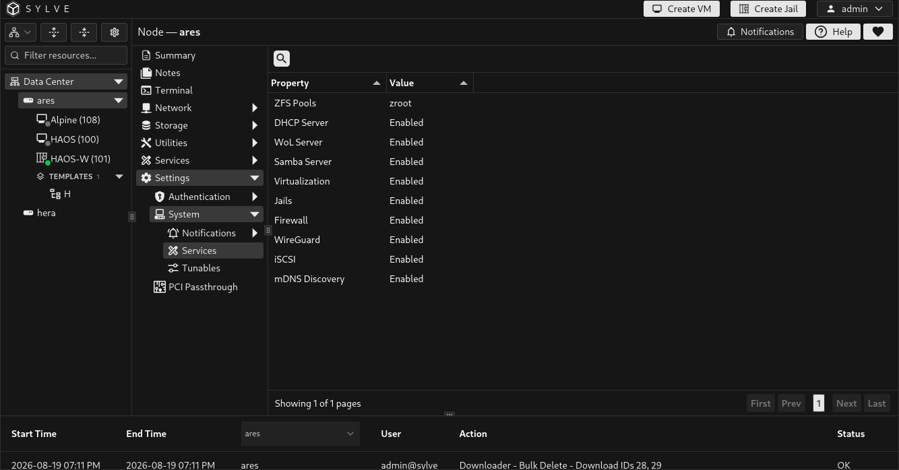
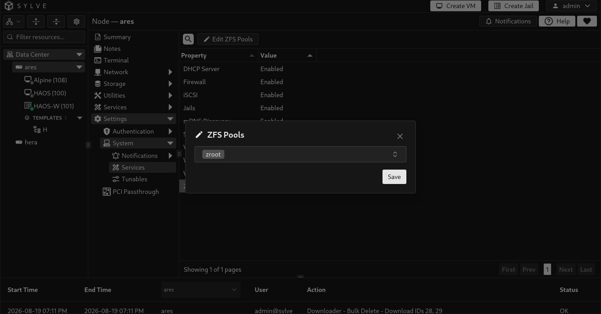
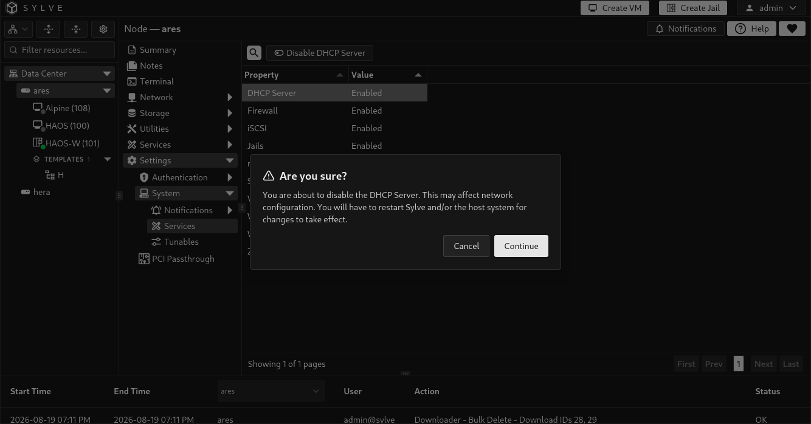

**Settings → System → Services** defines two important boundaries for a node: which ZFS pools Sylve is allowed to use, and which optional services it should manage. Select a row to reveal **Edit**, **Enable**, or **Disable**.

## ZFS Pools

Sylve intentionally does not assume that every pool visible on a node belongs to it. The **ZFS Pools** row is the explicit allow-list of pools that Sylve may use for storage, datasets, snapshots, and related workflows. This protects pools created or managed outside Sylve from accidental selection.

Existing pools can be selected during initial node setup or later from this page. Newly created pools are added automatically when you create them through Sylve. For pool-layout and creation guidance, see [ZFS Pools](/guides/node/storage/zfs/pools/).

1. Select **ZFS Pools** in the table.
2. Select **Edit ZFS Pools**.
3. Choose one or more currently available pools.
4. Save the complete selection.

### What happens when you change the selection

| Change | Sylve behavior |
| --- | --- |
| Add a pool | Verifies that the pool exists, prepares Sylve's required datasets on it, then adds it to the allowed-pool list. |
| Remove a pool | Removes permission only after checking that the pool is not still used by Sylve resources. The pool itself is not destroyed. |
| Save the same set | Makes no change. |

The interface requires at least one selected pool. When removing a pool, Sylve blocks the change if it has VM storage, VM storage datasets, jail storage, or periodic snapshot jobs associated with it. Move or remove those dependencies first.

:::caution
Do not use this setting as a way to hide a pool that still holds Sylve-managed workloads. Removing a pool from the allow-list does not delete it, but it can leave those workloads outside the normal management path. Resolve all dependencies before removing it.
:::

## Services

Service rows record whether a feature is enabled for this node. Enabling a feature allows its associated pages and runtime configuration to be used. Disabling it prevents Sylve from managing that feature after the next restart, but it does not delete the feature's saved configuration, shares, peers, rules, targets, or other data.

:::caution
After enabling or disabling any service, perform a complete node restart as soon as it is safe to do so. Some services apply their runtime state immediately, but a restart ensures that Sylve, the operating system, and every dependent service start from the same saved configuration. Continuing without one can produce undefined behavior in some service combinations.
:::

| Service | What enabling it provides | When the change takes effect |
| --- | --- | --- |
| **DHCP Server** | Sylve DHCP and DNS configuration using `dnsmasq`. | Starts or stops `dnsmasq` immediately. It is also started at node startup while enabled. |
| **WoL Server** | Wake-on-LAN support from Sylve. | Starts with Sylve after a restart. |
| **Samba Server** | SMB file sharing, share configuration, and audit-log collection. | Starts and reloads its configuration at startup. Restart the node after changing this setting. |
| **Virtualization** | VM management and VM runtime monitoring. | Starts its background monitoring at startup. Restart after changing this setting. |
| **Jails** | Jail management and jail statistics monitoring. | Starts its monitoring at startup. Restart after changing this setting. |
| **Firewall** | Sylve-managed PF firewall rules, NAT, logs, and counters. | Applies the managed firewall configuration immediately when enabled. Disabling it stops Sylve's managed PF configuration immediately. |
| **WireGuard** | Managed WireGuard servers, peers, and outbound clients. | Loads and synchronizes Sylve-managed WireGuard interfaces immediately. Disabling it tears down those managed runtime interfaces. |
| **iSCSI** | iSCSI initiators and targets. | Enabling writes the configuration, starts the initiator and target services, and connects configured initiator sessions. Restart after disabling if you need a clean runtime stop. |
| **mDNS Discovery** | Bonjour and mDNS service discovery, including managed Samba Apple and Time Machine advertisements. | Immediately publishes configured records when enabled, or unpublishes them when disabled. |

### Enable or disable a service

1. Select the service row.
2. Select **Enable** or **Disable**.
3. Read the confirmation carefully, especially for DHCP Server and Firewall.
4. Confirm the change.
5. Restart the node after changing the setting.

Sylve saves the service selection before applying a runtime change. If the runtime change fails, it rolls the selection back so the stored setting and the effective service state do not silently disagree.

:::caution
Changing **DHCP Server** or **Firewall** can immediately affect network connectivity. Make these changes from console access or another safe management path when the node is remote.
:::

### Service-specific notes

**Firewall** only manages the PF configuration it created. Disabling it stops the managed PF service state rather than removing your saved Sylve firewall rules. Re-enabling it applies the saved configuration again.

**WireGuard** requires the WireGuard service to be enabled before the Server and Clients pages can manage runtime configuration. Disabling it removes Sylve-managed runtime interfaces and associated managed firewall behavior, but retains the saved server, peer, and client configuration for later re-enablement.

**mDNS Discovery** is a node-wide switch. Disabling it immediately stops Bonjour discovery for all managed and custom records, including eligible Samba Apple and Time Machine shares. It does not delete those records or share settings.

**iSCSI** has a deliberate difference between enable and disable: enabling applies the configuration immediately, but disabling records the desired state without forcibly logging out sessions or stopping the system services. Restart the node when disabling iSCSI, and plan the change around any storage that depends on active iSCSI sessions.
