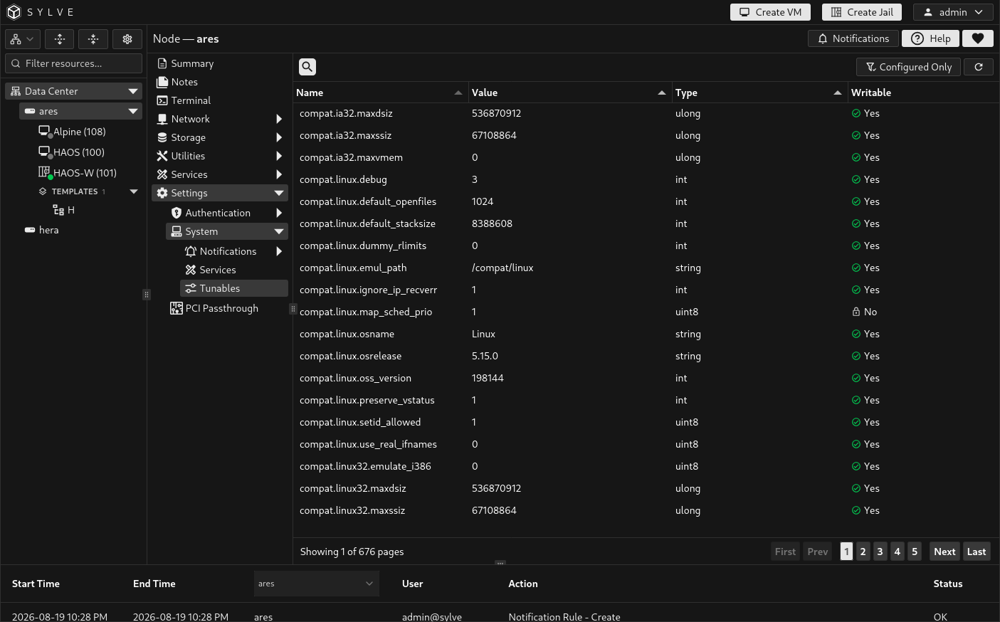
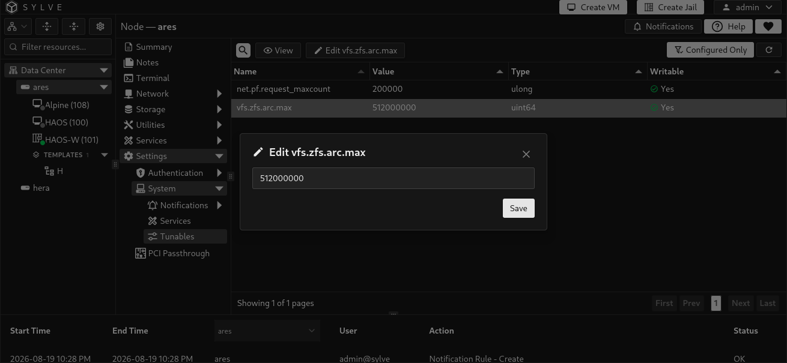

Tunables lists the node’s FreeBSD sysctl values. Use this page only when you understand the setting you are changing and have a specific workload or operating-system requirement.

The table shows each tunable’s name, current value, type, and whether the operating system marks it writable. Select a value to view it in full. Only writable values can be edited.

When you save a writable value, Sylve applies it and stores the requested value. Sylve reapplies stored tunables during startup, so this page is for persistent configuration rather than a temporary shell experiment.

Use **Configured Only** to show only tunables that Sylve has stored. It is the safest way to audit values managed through this interface.

## `vfs.zfs.arc.max` and automatic ARC tuning

`vfs.zfs.arc.max` sets the maximum amount of memory ZFS may use for its Adaptive Replacement Cache, or ARC. Its value is expressed in bytes.

When the node configuration enables `zfs.tune`, Sylve automatically sets this value at startup to 10% of the host’s memory, capped at 16 GiB. Saving `vfs.zfs.arc.max` through Tunables is different from saving an ordinary setting: Sylve treats it as your explicit override and skips that automatic calculation on later startups.

Use an explicit override only when you have sized ARC intentionally for the node’s workload and available memory. Tunables currently persists edited values and does not provide a UI action to remove a stored override, so treat this as a long-term configuration choice rather than a temporary experiment.

:::caution
Sysctl settings can affect networking, memory use, storage behavior, and system stability. Record the original value before changing one, change only one setting at a time, and keep console access available when modifying network-related values.
:::
