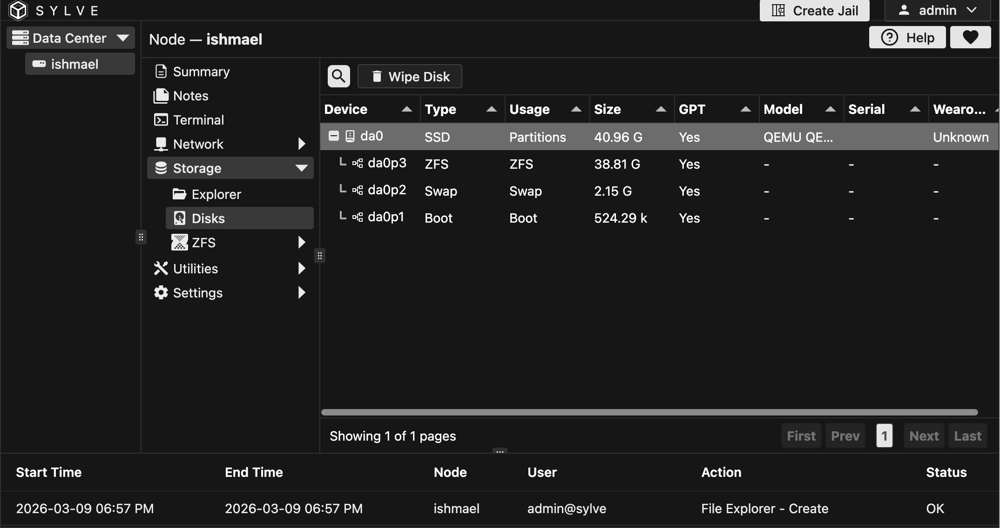
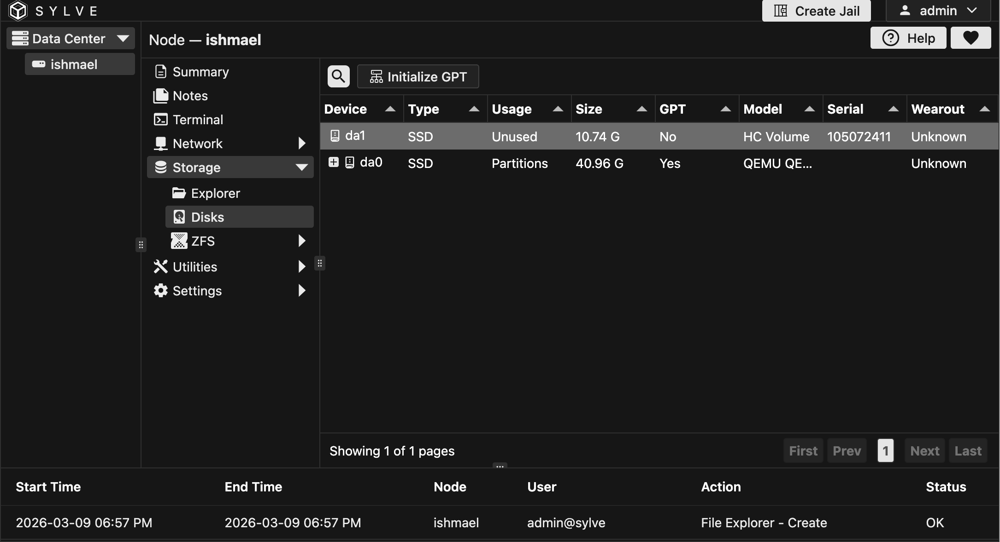
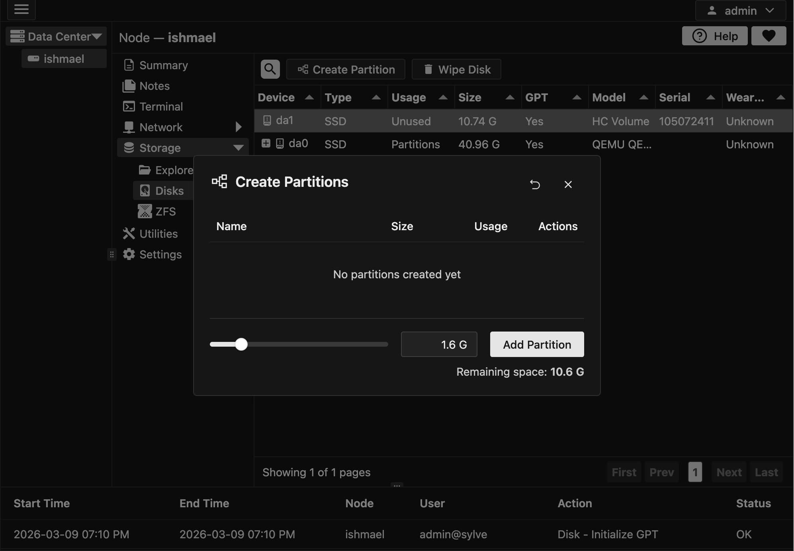
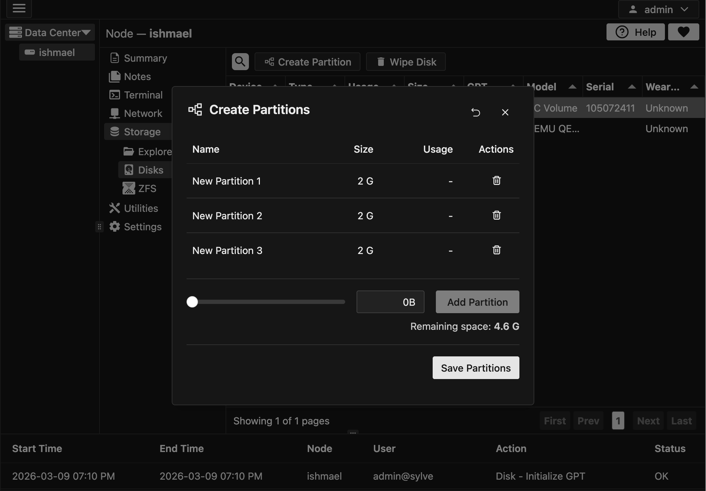
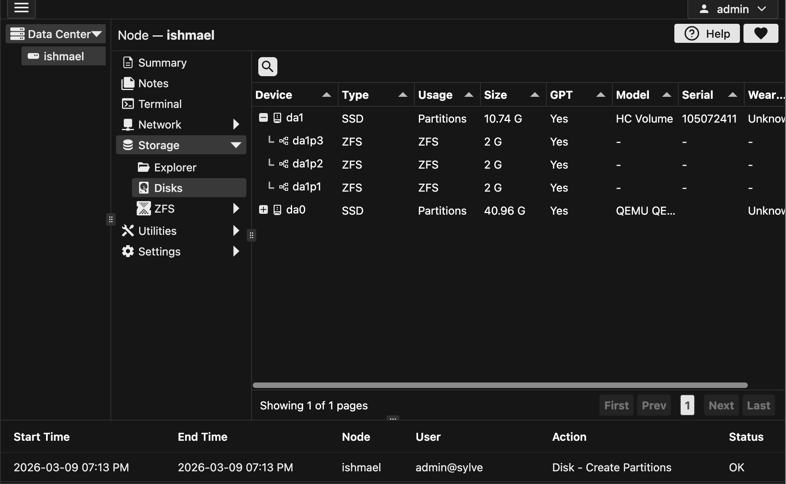

:::caution
Don't let the pretty UI fool you, these actions can be dangerous if you don't know what you're doing, especially formatting a disk, so please be careful and make sure you know what you're doing before performing any action in this section.
:::

## Wiping a disk

If you select a parent row (a row which has the model column populated), you will see some context options for that disk, one of them being "Wipe Disk"

## Initializing a disk

An unused disk will have an "Initialize Disk" option in the context menu, which allows you to initialize the disk with a GPT partition table, which is required before you can create partitions on the disk.

:::note
For usage with ZFS it is best you don't initialize the disk and just create a zfs pool on the raw disk, but for other use cases you might want to initialize the disk first.
:::

## Adding paritions to a disk

Once you have a disk initialized, you can add partitions to it by clicking on the "Create Partition" option in the context menu of the disk.

In my case, just for testing I'm going to create 3 partitions on this disk, of 2 GB each, but you can create as many partitions as you want and of whatever size you want, as long as they fit on the disk.

After adding your partitions, you should them as such in the modal:

Once you're content with the partitions you've added, you can click on the "Save Partitions" button and the partitions will be created on the disk, and you should see them in the table as such:

:::note
Don't mind that it shows ZFS under Type, that's just how the system identifies the partition, it doesn't mean that the partition is actually formatted with ZFS or something, in fact it's not formatted at all, it's just a raw partition, which we *could* use for ZFS.
:::