The **Disks** page lists the physical and virtual disks visible to a node. Select a disk row to reveal the actions that apply to it, such as viewing S.M.A.R.T. values, running a S.M.A.R.T. test, initializing GPT, creating partitions, or clearing a partition table.

:::caution
Disk and partition actions can destroy data. Confirm the device name, model, serial number, and current usage before you initialize, partition, delete, or clear a disk.
:::

## Disk inventory and wearout

Each parent row represents a disk. Expanded child rows represent its partitions. The table shows the device name, type, usage, capacity, GPT status, model, serial number, and wearout. Use the search field to narrow a long list of disks.

Wearout is the percentage of an SSD or NVMe device's rated endurance that the device reports as consumed. A lower value is better. For NVMe, Sylve uses the drive's `Percentage Used` S.M.A.R.T. value. For ATA SSDs, it uses a supported remaining-life attribute and converts it to consumed endurance. SCSI devices can report their wearout directly. Hard disks show `N/A`, and `Unknown` means the drive did not provide a supported, valid value.

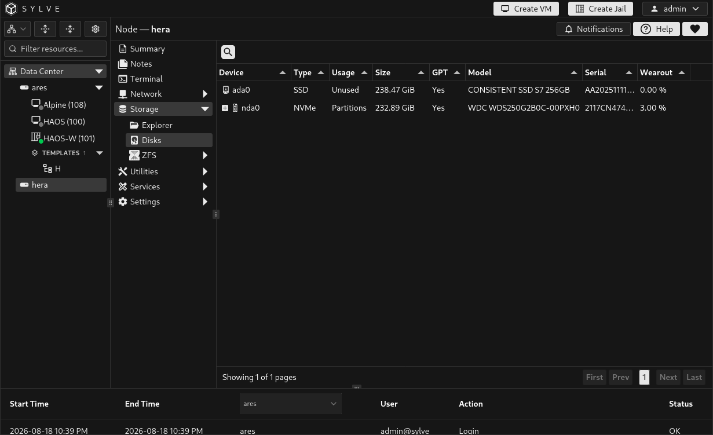

## S.M.A.R.T. values

Select a physical disk and choose **S.M.A.R.T. Values** to inspect the health information reported by the drive. Sylve presents the data in the form that is most useful for the device:

- NVMe drives show a summary of controller health, including critical-warning flags, spare capacity, percentage used, temperature, power cycles, power-on hours, data units read and written, unsafe shutdowns, media errors, and error-log entries.
- ATA and SATA HDDs or SSDs show their S.M.A.R.T. attribute table. Each row includes the attribute ID and name, normalized value, worst recorded value, threshold, raw value, and raw string.
- Devices that do not expose S.M.A.R.T. data do not offer this action.

Use these values together with the disk's health status and vendor documentation. A single counter is not a complete diagnosis.

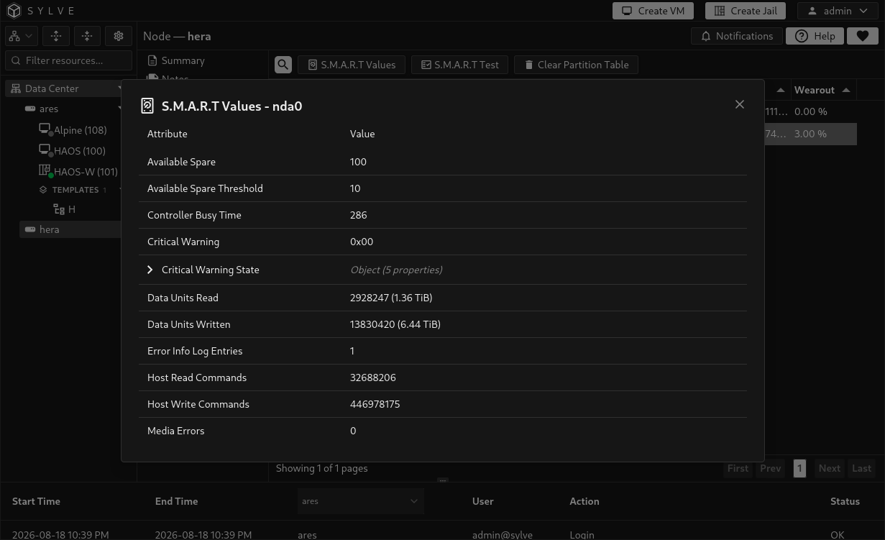

## S.M.A.R.T. tests

Select a disk with S.M.A.R.T. data and choose **S.M.A.R.T. Test**. The dialog has three tabs: **Run Test**, **History**, and **Schedule**. Sylve shows only the test types supported by the selected device.

### Running a test

The **Run Test** tab lets you select a test and start it. A **Short** test is a quick diagnostic and is the recommended routine check. An **Extended** test performs a more thorough media diagnostic and can take several hours. Some drives also support a **Conveyance** test, which checks for transport-related damage.

The selected test keeps the disk online, but it consumes device resources and can temporarily reduce I/O performance. The duration shown by Sylve is the drive's estimate, not a deadline. Actual time and progress depend on the device, its firmware, and current activity.

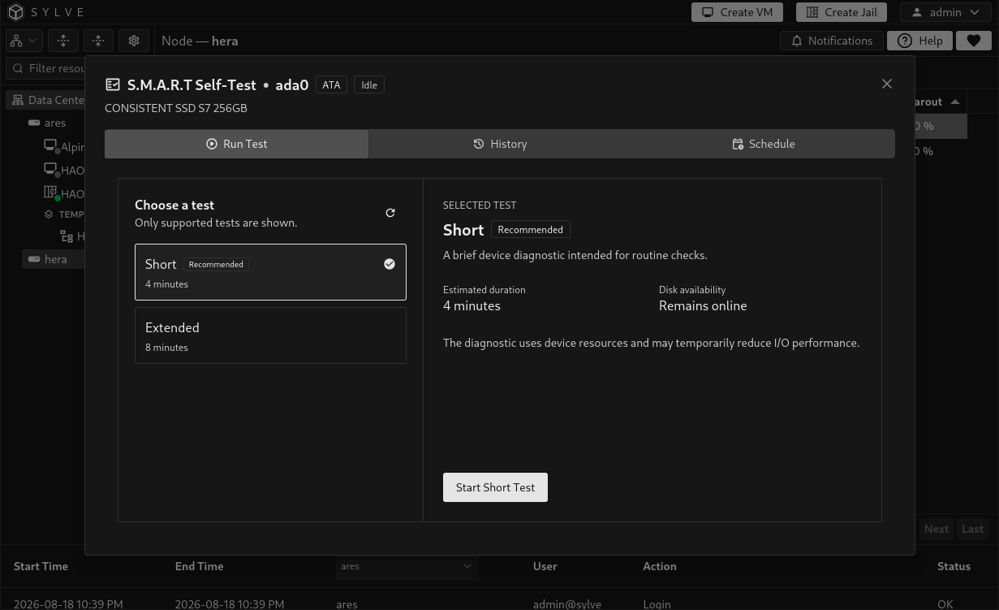

While a test is running, the dialog shows its execution state, type, estimated duration, and progress when the drive reports it. A test continues on the device after the dialog is closed. If the device supports aborting tests, Sylve also offers **Abort Test**.

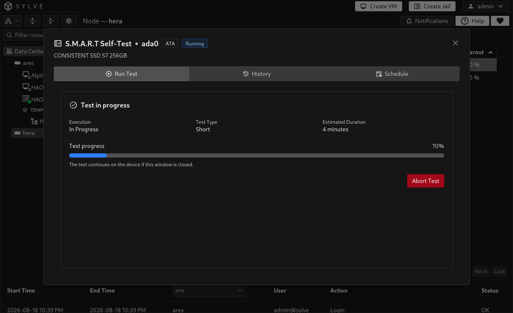

### Historical results

The **History** tab records the self-test results returned by the device. The table includes:

- **Date**: when the result was recorded, if the device provides a timestamp.
- **Type**: the diagnostic that ran, such as Short or Extended.
- **Mode**: the test mode when the protocol reports one. NVMe does not report this mode.
- **Result**: the reported outcome, including passed, failed, aborted, or in progress.
- **Drive Hours**: the device's power-on hours at the time of the result.
- **First Error**: the reported namespace or first failing logical block address, if available. A completed test with no reported error is shown as `No errors`.
- **Details**: additional status, remaining progress when stopped, and protocol-specific diagnostic details.

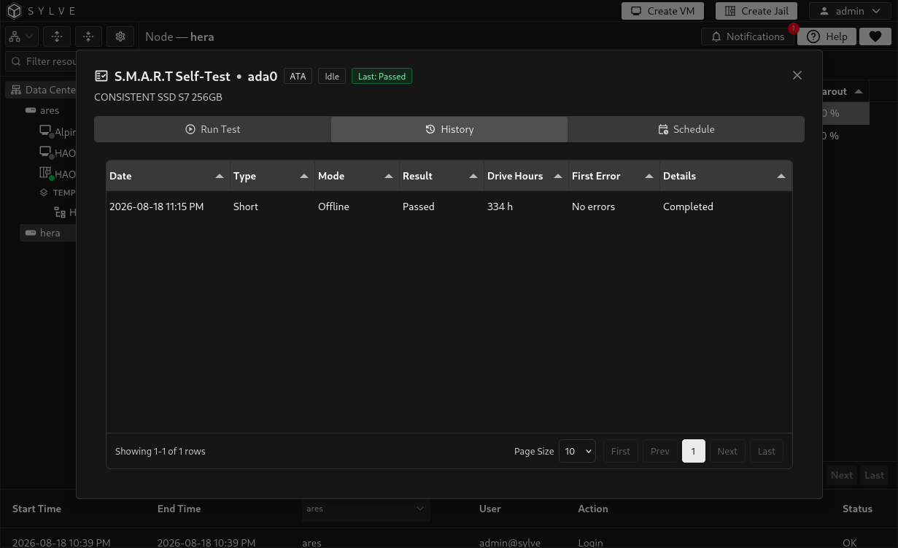

### Scheduling tests

Use the **Schedule** tab to create recurring Short or Extended tests for a disk. Select **Add Schedule**, choose a supported test type, then select a preset or enter a cron expression. Schedules are opt-in and use the node's local time. Sylve displays the next and last run times in your browser's local time.

Schedules require a stable disk identity, such as a unique serial number or LUN identifier, so they remain associated with the same physical drive if its device name changes. Only one schedule of each test type can be configured per disk. If another disk test is active, a scheduled run waits in the queue until the shared test slot is available.

The example below has an enabled Short test scheduled for every Sunday at 02:00 on the node.

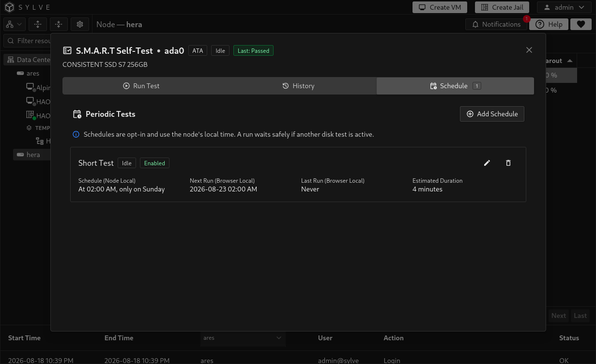

## Clearing a partition table

Clearing a partition table removes the table and all partitions from a disk. It does not securely erase every data block on the device. This action is available for an unused disk or a disk that currently has partitions, but not for a disk in use by ZFS.

Select the parent disk row, then choose **Clear Partition Table** and confirm the warning.

:::note
To use a whole disk in a ZFS pool, clear existing partition tables first. If you intend to use partitions as ZFS vdevs instead, initialize the disk and create those partitions instead.
:::

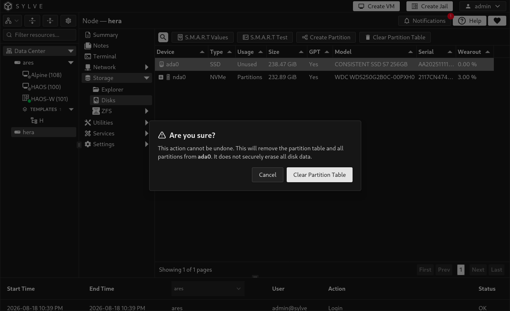

## Initializing GPT

An unused disk without a partition table offers **Initialize GPT**. This creates a GUID Partition Table, which is required before you can create partitions in Sylve.

:::note
For a whole-disk ZFS pool, leave the disk uninitialized and add the raw disk to the pool. Initialize GPT only when you need a partitioned layout.
:::

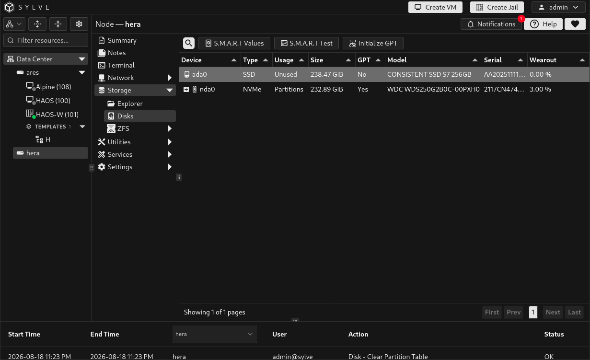

## Creating partitions

After a disk has a GPT partition table, select its parent row and choose **Create Partition**. Specify the size for each partition, then review the proposed layout in the partitioning dialog. Sylve requires at least 128 MiB of free space before it enables partition creation.

This example creates three 32 GiB partitions. The sizes and number of partitions are up to you, provided they fit in the remaining space on the disk.

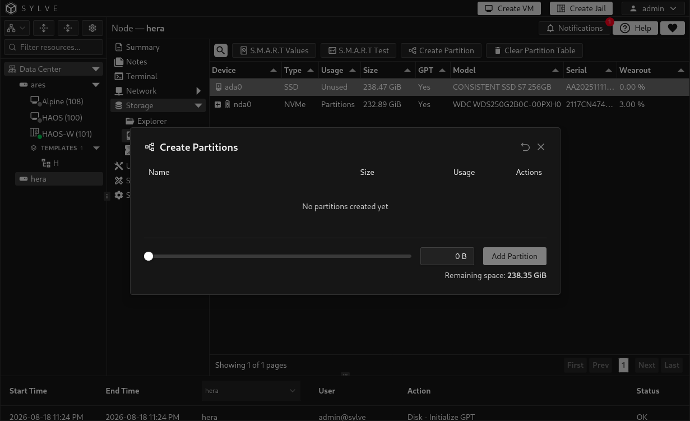

Review the partition list before selecting **Save Partitions**. Saving creates the partitions on the disk, and the new entries then appear as child rows in the table.

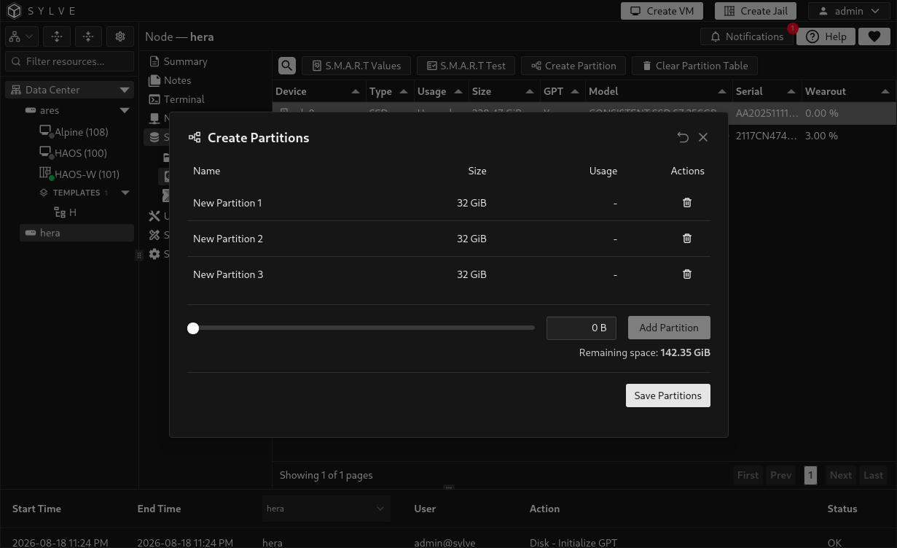

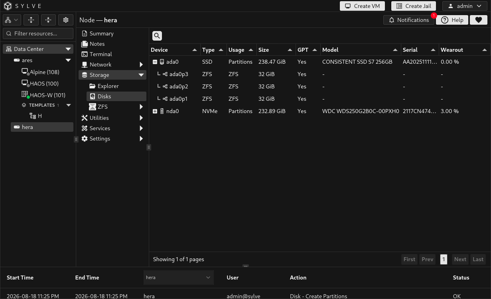

:::note
The **Type** shown for a partition is how the operating system identifies it. It does not by itself format the partition with ZFS or another filesystem. A newly created partition is raw until you assign it to a storage workflow or format it elsewhere.
:::
