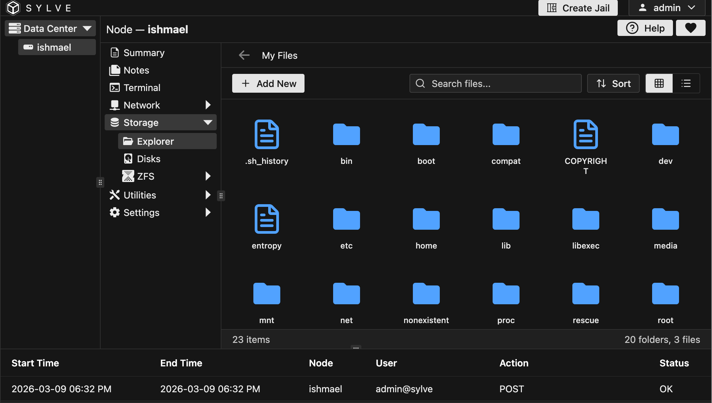
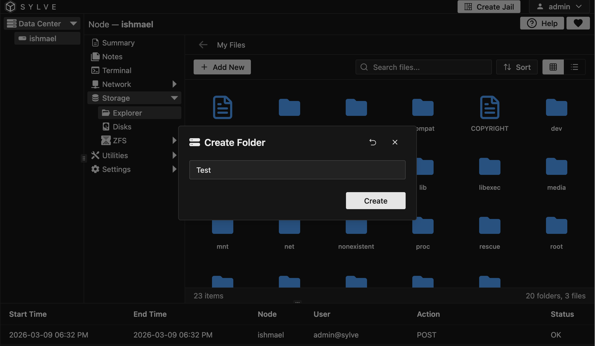
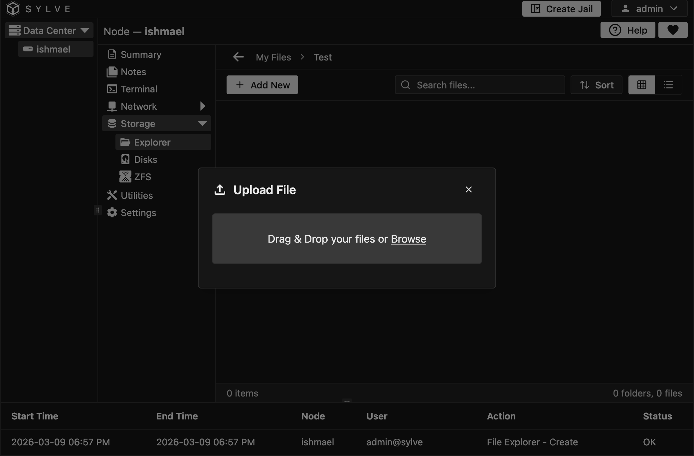
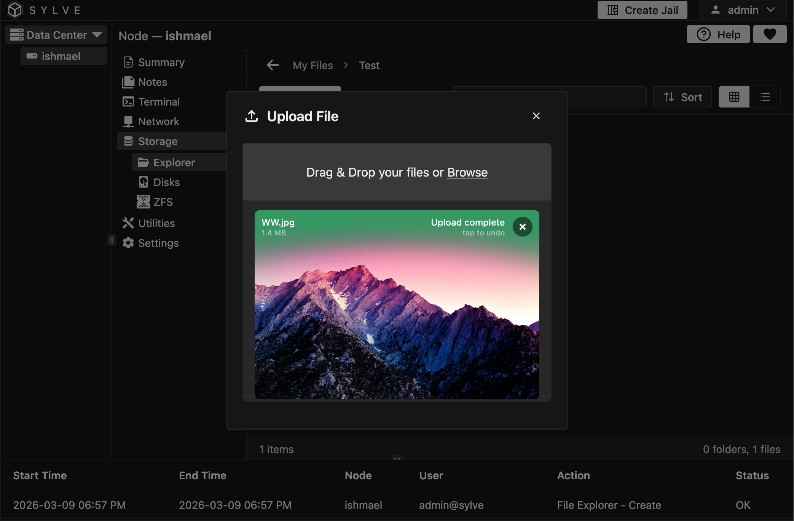
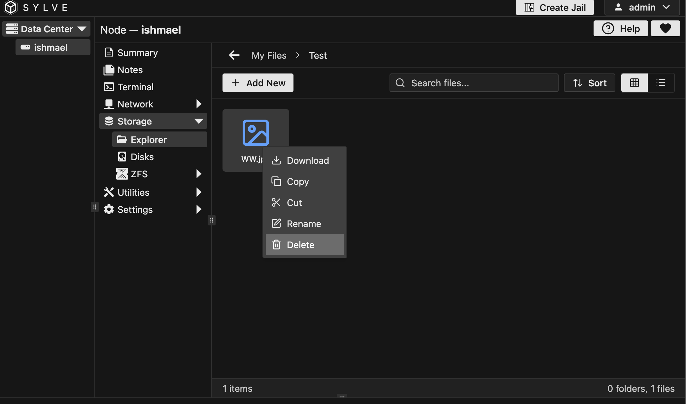

In this section, we will go over the file explorer in Sylve, which is a web based file explorer that you can use to browse and manage files on your host. 

When you open the file explorer, you will see this UI:

On the top left corner you can see an "Add New" button, which allows you to add a new file or folder, it even supports uploads! You can also navigate to directories, copy paste etc.

## Adding a new File/Folder

When you click on the "Add New File/Folder" button, you will see this form:

You can just give any name you like and click on the "Create" button.

## Uploading a File

When you click on the "Upload File" button a form pops up asking you to select a file as such:

You can either drag/drop a file into the modal or you can click to upload a file. Once you do drop in/select a file it should look something like this:

## File Actions

You can click outside the modal to close it, and you should see the file you just uploaded in the file explorer. You can also click on the file to open it, or right click to see more options like download, copy, cut, rename, delete.

