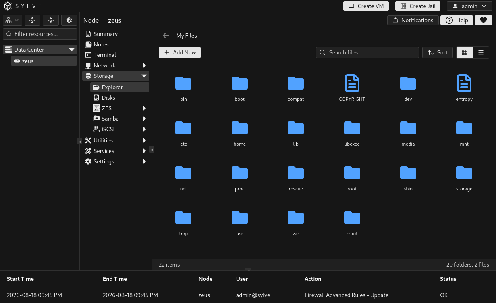
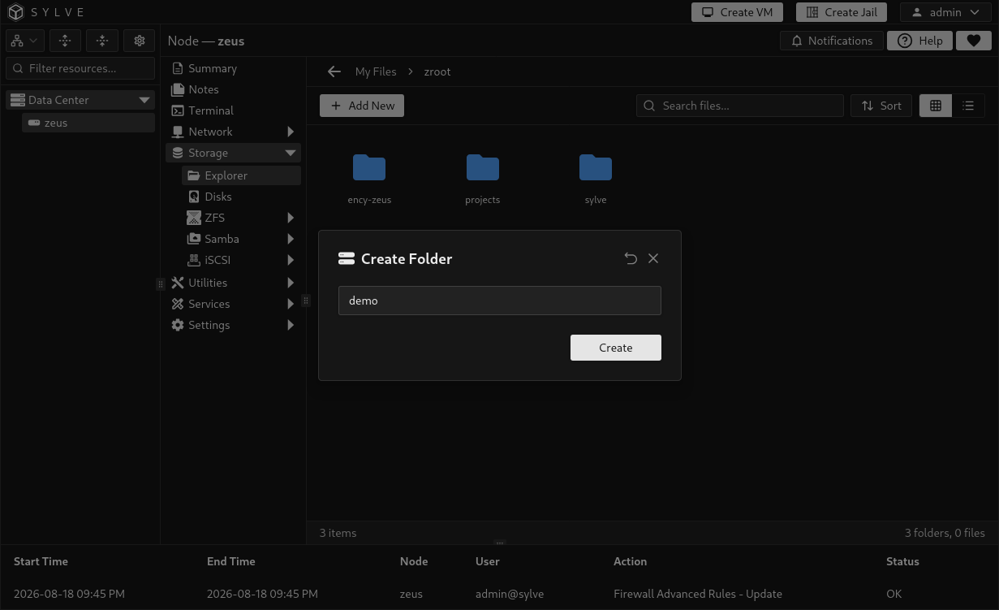
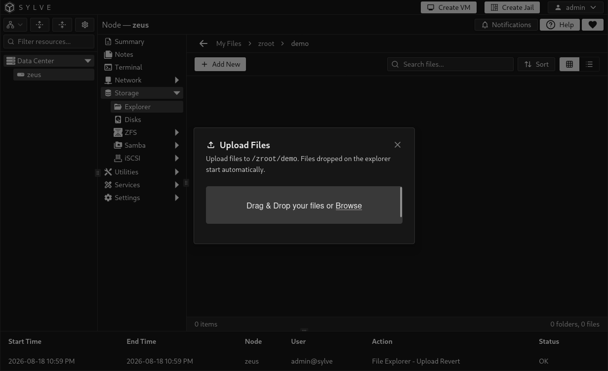
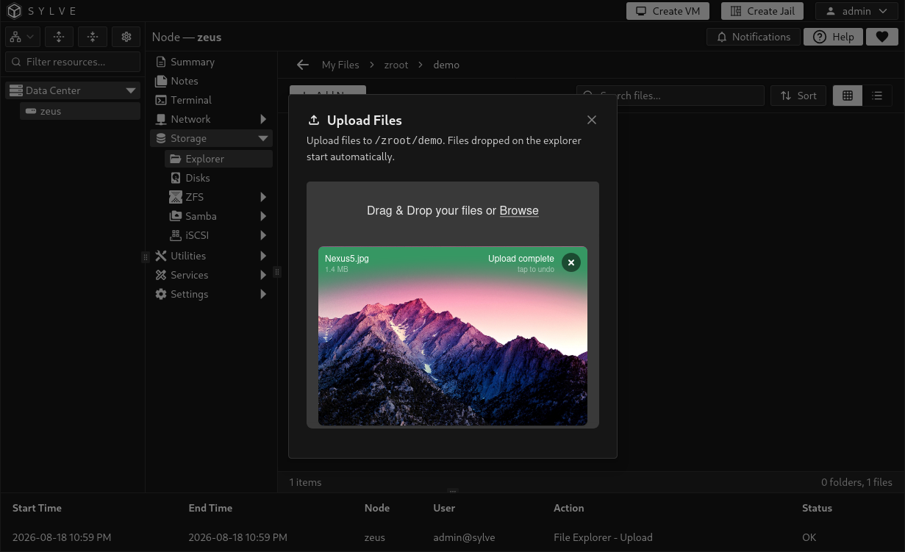
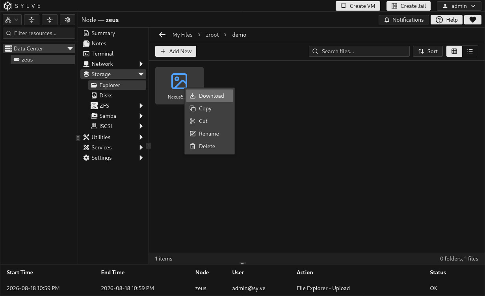

In this section, we will go over the file explorer in Sylve, which is a web based file explorer that you can use to browse and manage files on your host. 

When you open the file explorer, you will see this UI:

It opens the "/" path by default. On the top left corner you can see an "Add New" button, which allows you to add a new file or folder, it even supports uploads. You can also navigate to directories, copy paste etc.

## Adding a new File/Folder

In this example we're going to create a new folder under `/zroot` named `demo`, so we navigate to `/zroot` and then When you click on the "Add New File/Folder" button, you will see this form:

You can just give any name you like (in our case it's `demo`) and click on the "Create" button.

## Uploading a File

Now our goal is to upload something into this demo folder that we've just created. When you click on the "Upload File" button a form pops up asking you to select a file:

You can either drag/drop a file into the modal or you can click to upload a file. Once you do drop in/select a file it should look something like this:

When you drop a file into this modal, the update begins immediately but to cancel/delete an upload just press the "X" button shown in the preview/list element in the modal. Once your uploads are done you can close the upload modal completely by clicking on the "X" button on the top-right section of the modal.

## File Actions

You can also right click on the file to download, copy, cut, rename or delete it:

The same action goes for all folders and files as well.