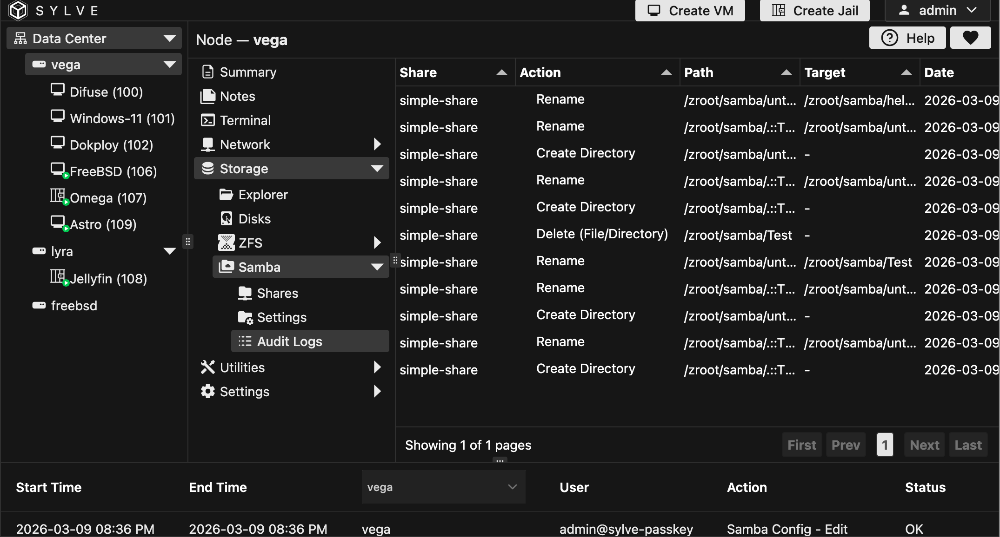

## Viewing Logs

In the Audit Logs page you can see all the samba audit logs in a table like this:

The table is pretty self-explanatory, it shows the timestamp of the log, the username of the user who performed the action, the action that was performed and the path of the file or directory that was affected by the action.