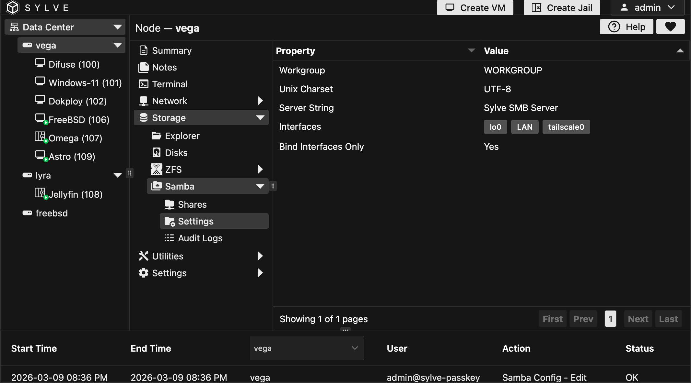

As mentioned in the preface of the Shares guide, the samba implementation in Sylve is pretty basic and doesn't have a lot of features, but it does cover the basics and is enough for most use-cases. In this guide we'll be going through the settings that we do have and how to configure them.

When you open up the Samba Settings page, you'll see a table like this:

Let's go through the fields one by one:

- **Workgroup**: The workgroup name for your samba server, this is the name that will be displayed in the network section of samba clients when they scan for available servers. The default value is `WORKGROUP`, but you can change it to whatever you want.

- **Unix Character Set**: The character set that will be used for file names and other strings in samba, the default value is `UTF-8` which is the most common character set and should work fine for most use-cases.

- **Server String**: The server string is a description of your samba server that will be displayed in the network section of samba clients when they scan for available servers. The default value is `Sylve SMB Server`, but you can change it to whatever you want.

:::warning
Binding to an interface which has a public IP address can be dangerous if you don't have proper firewall rules in place, make sure to only bind to interfaces that are not exposed to the internet and always use a VPN or a secure tunnel like WireGuard or Tailscale when accessing your samba shares remotely.
:::

- **Interfaces**: The network interfaces that samba will listen on, you can select multiple interfaces here. By default, samba will listen on ONLY the loopback interface.

- **Bind Interfaces Only**: Whether to bind samba to the selected interfaces only, if enabled samba will only listen on the selected interfaces and ignore all other interfaces. This is enabled by default for security reasons, but you can disable it if you want samba to listen on all interfaces.