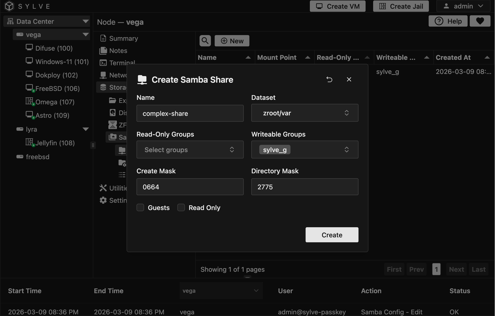
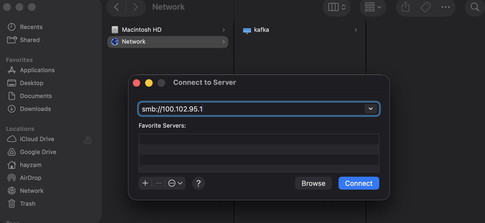
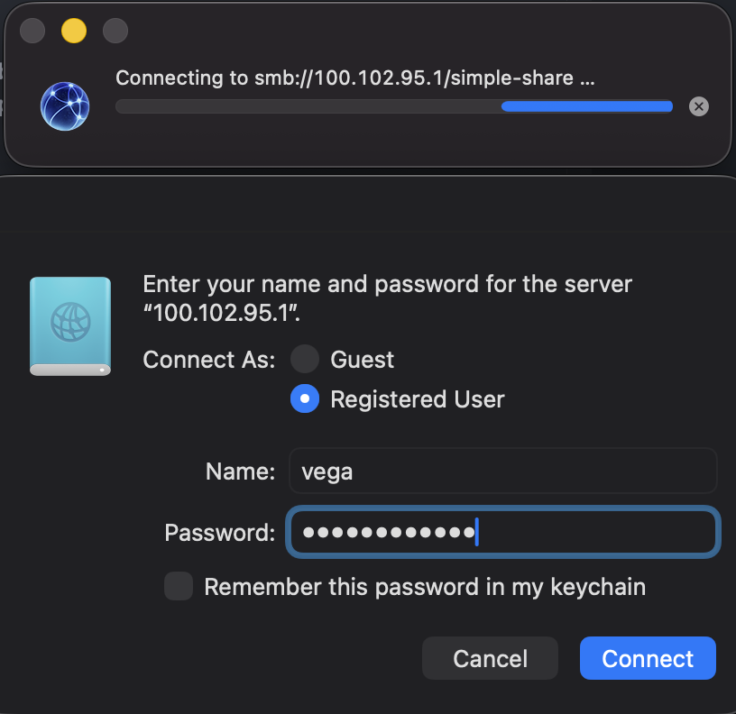
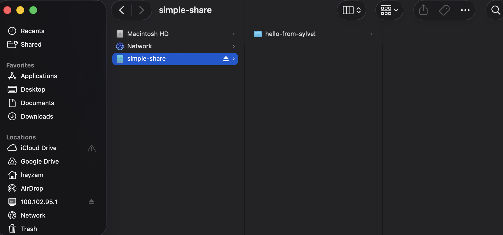

## Pre-Requisites

You should have local users and/or groups ready before creating a share. You can manage both from the Authentication section.

## Preface

Samba Shares are extremely simple in Sylve, just covering the basics. For our use-case this was plenty, but more features and improvements are definitely needed here, that being said we believe a lot of users' requirements are met with the implementation we do have.

If you're someone with extensive samba knowledge/experience please get in touch with us over GitHub or Discord, would love to chat and this is one area where we're actively looking for PRs on!

## Create a Samba Share

Creating a samba share is relatively simple, clicking on the "New" button in the context menu opens a form like this:



Let's go through the fields one by one:

- **Name**: The name of the share, this is what will be displayed in the samba clients when they connect to the server.

- **Dataset**: The dataset you want to share, this is the path that will be shared over samba. You can create one in the ZFS/Filesystem section if you don't have one already.


- **Read Users**: Users that get read access.

- **Write Users**: Users that get write access.

- **Read Groups**: Groups that get read access.

- **Write Groups**: Groups that get write access.

Sylve uses **write-wins** normalization. If the same user/group is selected in both read and write lists, it is treated as write access.

- **Create Mask**: The permissions that will be set on files created in the share, this is a standard unix permission mask. The default value is `0664` which means that the owner and group will have read and write permissions, while others will have read-only permissions.

- **Directory Mask**: The permissions that will be set on directories created in the share, this is a standard unix permission mask. The default value is `2775` which means that the owner and group will have read, write and execute permissions, while others will have read and execute permissions.

- **Guest Only**: Whether to make this a guest-only share. If enabled, authenticated user/group access is disabled for that share.

- **Guest Writeable**: Only shown in guest-only mode. Controls whether guests can write or read-only.

## Editing a Samba Share

Editing a samba share is just as simple as creating one, clicking on the "Edit" button in the context menu and do whatever changes you want to make, then click "Edit" to apply the changes.

## Deleting a Samba Share

Deleting a samba share is also simple, just click on the "Delete" button in the context menu and confirm the deletion. This will permanently delete the share and all its configurations, but it will not delete the underlying dataset or files.

## Accessing the Samba Share

:::warning
Never ever expose samba directly to the internet, if you want to access your samba shares remotely, use a VPN or a secure tunnel like WireGuard or Tailscale. Samba is not designed to be exposed to the internet and doing so can lead to serious security vulnerabilities.
:::

In this demonstration we'll be accessing the samba share from a macOS client over tailcale, but the process is similar for other operating systems as well.

:::note
Modern Windows versions may block insecure SMB guest logons by default. If guest-only shares fail from Windows clients, check the client-side SMB guest logon policy.
:::



In the "Connect to Server" dialog, enter the address of your Sylve server in the following format:

```
smb://<IP_ADDRESS_OR_HOSTNAME>/<SHARE_NAME>
```



After the authentication is successful, you should see the contents of the share in the Finder.


