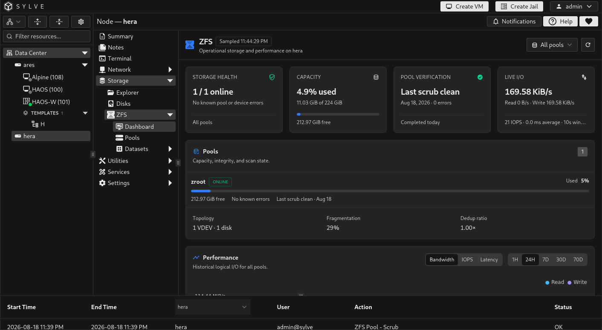
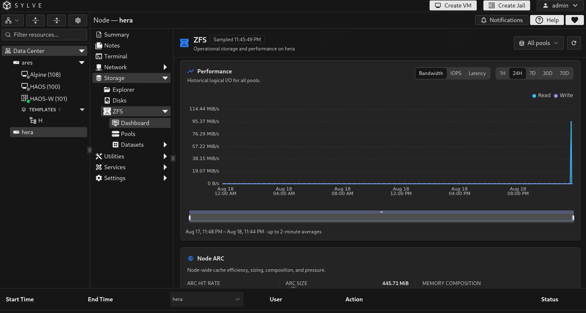
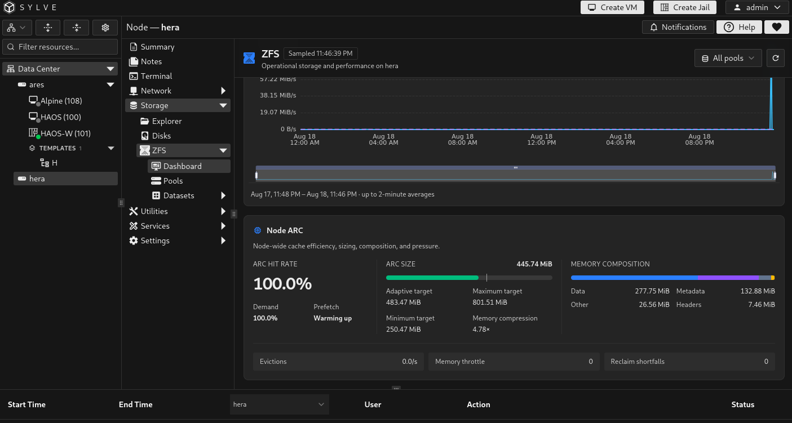

The **ZFS Dashboard** is the operational overview for a node's imported ZFS pools. It combines the latest pool status with historical performance and node-wide ARC cache telemetry. It is a monitoring page: use the [Pools](/guides/node/storage/zfs/pools/) page to create or change a pool.

Use the pool selector in the toolbar to switch between **All pools** and an individual pool. The dashboard refreshes live status while the page is visible, and the refresh button requests an immediate update. The timestamp in the toolbar shows when the displayed live data was sampled. A **Stale** badge means Sylve could not obtain a recent live sample, although historical performance data may still be available.

## Operational summary

The summary cards combine every pool in the current scope. When **All pools** is selected, capacity and I/O values are totals, while fragmentation, deduplication ratio, and latency are weighted summaries. Selecting one pool shows that pool's values alone.

| Card | Values shown | What to look for |
| --- | --- | --- |
| **Storage health** | The number of pools in `ONLINE` state out of the selected total, plus a count of known read, write, checksum, and scan errors. | `ONLINE` is healthy. `DEGRADED` needs review. `OFFLINE` and `REMOVED` are more severe. `FAULTED`, `UNAVAIL`, `UNAVAILABLE`, `SUSPENDED`, and `CORRUPT_DATA` are treated as critical. An unrecognized state is shown with a warning. |
| **Capacity** | Percentage used, allocated space out of total capacity, and free space. | The card warns at 80% used and is critical at 90% used. Leave headroom for copy-on-write allocation, snapshots, and normal pool operation. |
| **Pool verification** | The status of the latest scrub or resilver, including progress and bytes examined or processed while a scan is active. | Active values can be **Scrubbing**, **Scrub paused**, **Resilvering**, or a count of active scans. Completed values can be **All scans clean**, **Last scrub clean**, or **Resilver complete**. Warnings include **Verification incomplete**, **Verification unknown**, and **Never scrubbed**. Any scan errors are critical. |
| **Live I/O** | Combined read and write throughput, read and write breakdown, total IOPS, weighted average latency when the node reports it, and the sampling window. | `Unavailable` means no valid I/O sample is available yet. Latency can be unavailable even when throughput and IOPS are present. Compare the values with the workload's normal baseline before treating a spike as a problem. |

The **Storage health** count treats a pool as online only when its state is exactly `ONLINE`. Known errors are the combined read, write, checksum, and scan-error counters returned by ZFS. If Sylve cannot obtain detailed status for one or more pools, the card states that device status is unavailable.

The **Pool verification** card chooses the most urgent relevant status in the current scope. For example, an active scrub is shown before a clean historical result, and reported scan errors take precedence over an incomplete scan. If multiple pools are selected, the card summarizes their overall condition while the **Pools** panel identifies the affected pool.

If Sylve detects an issue, an alert appears below these cards. It can indicate stale telemetry, a pool state that needs attention, known errors, or unavailable detailed status.

## Pools

The **Pools** panel lists each imported pool in the current scope. Each row shows its health state, capacity used, free space, error status, and scrub or resilver state. Select a pool row to focus the rest of the dashboard on that pool.

Below the list, the dashboard summarizes the selected scope's data VDEVs and disks, fragmentation, and deduplication ratio. Fragmentation is a pool-level measure of allocation layout, while the deduplication ratio compares logical data with the physical storage used after deduplication.

## Performance history

The **Performance** card charts historical logical I/O for the selected pool or all pools. Use the controls to choose what the chart displays:

- **Bandwidth** compares read and write throughput over time.
- **IOPS** compares read and write operations per second.
- **Latency** shows read and write latency where the node can report it.
- **History range** changes the time window used for the chart.

The note below the chart states the available time span and sample resolution. A gap or unavailable series usually means that data was not collected for that interval or that the underlying counter is unavailable. Historical values describe logical ZFS I/O, not necessarily every physical device operation.

## Node ARC

The **Node ARC** section describes the Adaptive Replacement Cache shared by ZFS on the node. It is node-wide, so it is not limited to the pool selected in the toolbar.

**ARC hit rate** is the percentage of cache lookups served from ARC rather than needing storage I/O. **Demand** is the hit rate for requested reads, while **Prefetch** is the hit rate for predictive reads. A newly started collector may show **Warming up** until it has enough data to calculate these ratios.

**ARC size** shows the current cache size against its adaptive target, minimum target, and maximum target. The target adjusts in response to memory pressure and workload. **Memory compression** compares the cache's uncompressed data with its compressed memory footprint.

**Memory composition** breaks the current ARC allocation into data, metadata, other allocations, and headers. This is useful when determining whether the cache is primarily holding file data or filesystem metadata.

## ARC pressure and L2ARC

The lower ARC counters help identify cache pressure:

- **Evictions** is the current rate at which ARC entries are removed to make room for other entries.
- **Memory throttle** counts events where ZFS had to limit activity because memory was constrained.
- **Reclaim shortfalls** counts times ARC could not reclaim enough memory as requested.

High or increasing pressure counters deserve investigation alongside overall system memory use and workload behavior. They are signals to investigate, not automatic proof that ARC limits should be changed.

If the node has L2ARC devices, Sylve also shows their allocated cache size, hit rate, and device count. L2ARC is a secondary read cache and does not replace ARC. Its usefulness depends on the workload and the working set that can be retained in cache.
