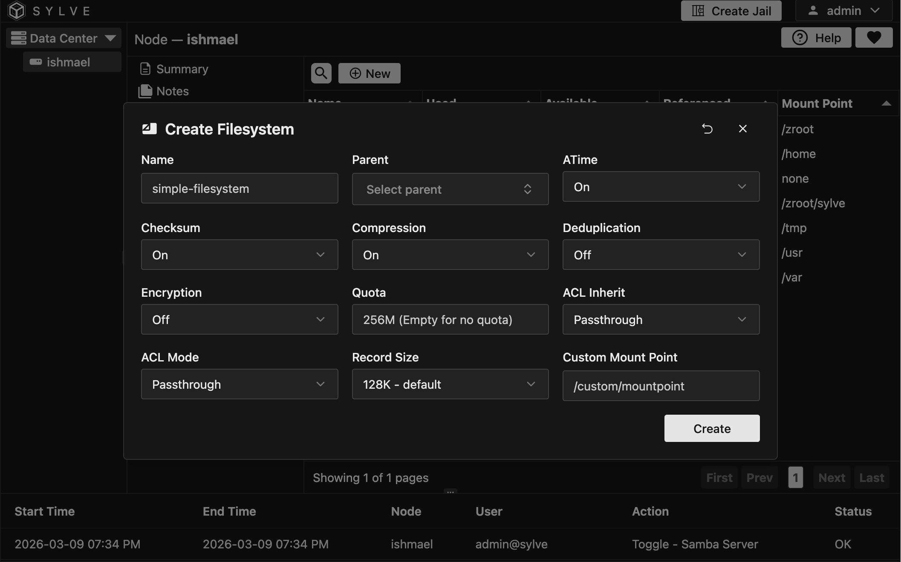
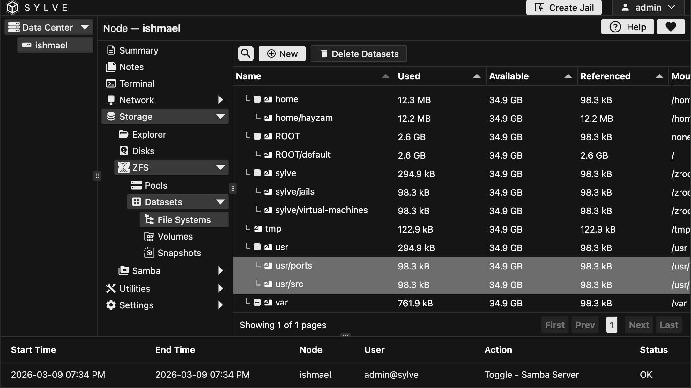

In the ZFS Filesystems section, you can manage all your ZFS filesystems in one place. Let's go over the various actions you can perform on your filesystems.

## Create Filesystem

Creating a ZFS filesystem is a straightforward process. You can create a new filesystem by clicking on the "New" button in the context menu and filling out the form:

Let's go over the options:

- **Name**: This is the name of your filesystem. It should be unique within the pool and can be used to identify the filesystem later.

- **Parent**: This is the parent dataset for the filesystem. You can choose to create the filesystem at the root of the pool or under an existing dataset.

- **Properties**: You can set various properties for your filesystem, such as compression, deduplication, and more. For more information on the available properties and their usage, check out the [ZFS properties documentation](https://openzfs.github.io/openzfs-docs/man/master/7/zfsprops.7.html).

## Editing Filesystems

You can edit the properties of an existing filesystem by selecting it and clicking on the "Edit" button in the context menu. This will open a form similar to the one used for creating a filesystem, where you can modify the properties as needed.

## Deleting Filesystems

You can delete a filesystem by selecting it and clicking on the "Delete" button in the context menu. A confirmation dialog will appear to ensure you want to proceed with the deletion.

You can also choose to delete multiple filesystem datasets at once by selecting them and clicking on the "Delete Datasets" button, this will delete all selected datasets and their children (if any).

