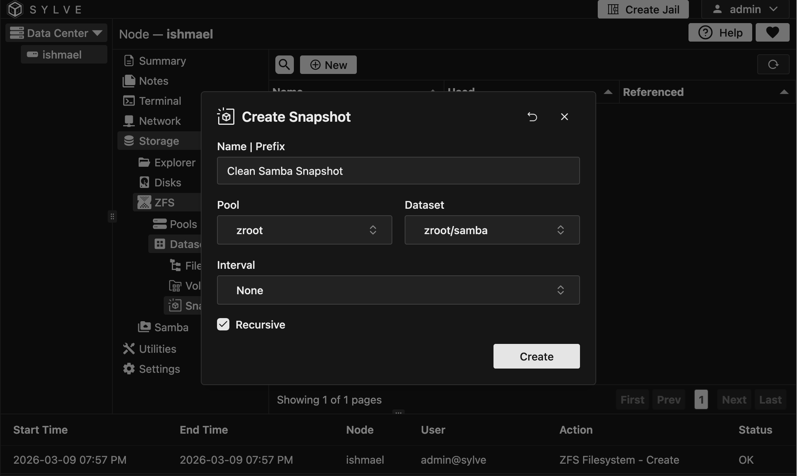
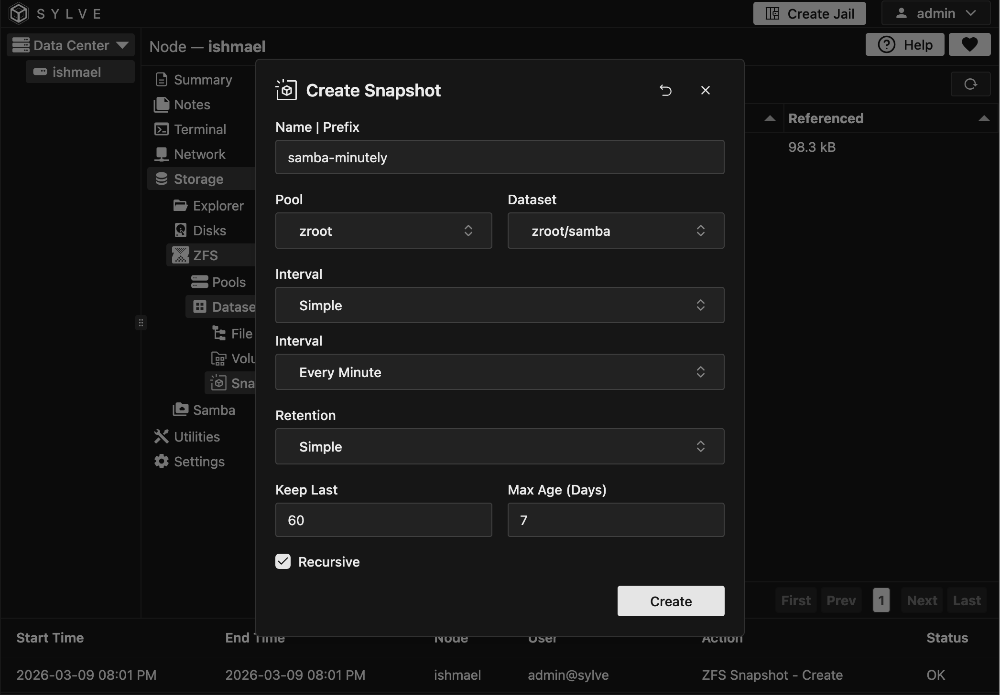
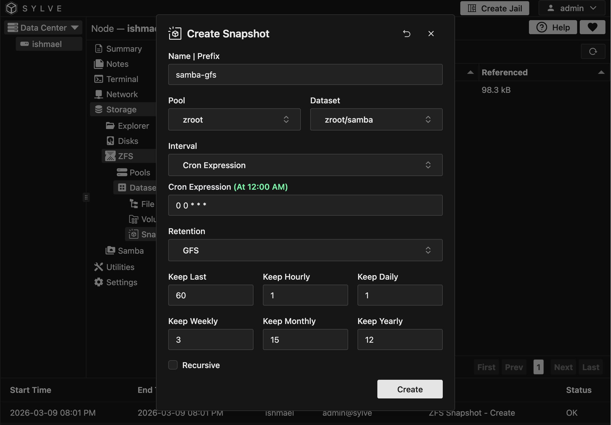
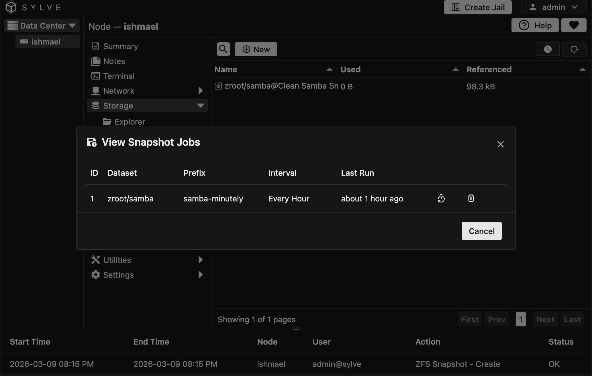

:::note
VMs and Jails already provide a snapshot feature, so if you just want to snapshot a VM or Jail, you can do so from the VM or Jail details page. The snapshots created from the VM or Jail details page will also be visible in the ZFS Snapshots section.
:::

In the ZFS Snapshots section, you can manage all your ZFS snapshots in one place. Let's go over the various actions you can perform on your snapshots.

:::caution
The snapshots table is pretty special. To optimize performance, heavy caching is done on the backend of all known (snapshot) datasets, and a full pool rescan for snapshots is only triggered when a ZFS event is detected. This means that if you create a snapshot elsewhere (for example via the CLI) or even through the UI, it may take a few seconds and in rare cases up to a few minutes — before it appears in this table.

The reason for this design is that some systems may contain hundreds of thousands or even millions of snapshots. Performing a full zfs list -t snapshot scan on every page load would be extremely expensive and could significantly impact system performance. By caching snapshot metadata and only refreshing it when relevant ZFS events occur, the interface remains fast and responsive even on very large installations.

There is a convenient refresh button given on the top right corner of the table which can be used to refresh the snapshot list in the frontend table.
:::

## Create Snapshot

In this example we're going to make 3 kinds of snapshots:

1. A simple one time snapshot of a dataset
2. A snapshot with a simple interval and retention policy
3. A snapshot with a more complex interval and GFS based retention policy

### Simple Snapshot

This is the most straight forward way to create a snapshot, it's a one time snapshot of a dataset. To create a simple snapshot, click on the "New" button in the context menu and fill out the form:



Let's go over the options:

- **Name**: The name of the snapshot. This is required and must be unique within the dataset.

- **Pool**: The pool that the dataset belongs to, without selecting this the dataset field won't have any datasets.

- **Dataset**: The dataset that you want to snapshot.

- **Interval**: This is the interval at which the snapshot will be taken. For a simple snapshot, you can leave this empty or set it to "None".

- **Recursive**: If you want to snapshot all child datasets as well, you can enable this option.

### Snapshot with Simple Interval and Retention Policy



As you can see above we have gotten new options when an interval type is given namely:

- **Interval**: You can choose from an array of simple options like `Every Minute`, `Every Hour`, `Every Day` etc.

- **Retention**: You can choose between "Simple" retention or GFS. Grandfather-Father-Son (GFS) retention is a long-term backup strategy that organizes backups into hierarchical cycles (typically weekly, monthly, yearly) to balance data retention compliance with storage costs. In this snapshot policy we're going to stick with "Simple"

- **Keep Last**: This is the number of last snapshots you want to keep for this policy, pruning the rest.

- **Max Age (Days)**: This is the maximum age of a snapshot in days, after which it will be pruned.

### Snapshot with Complex Interval and Retention Policy



In this example we're going to set up a more complex snapshot policy with a custom interval and GFS retention.

- **Interval**: You can choose "Cron Expression" from the interval options, which will allow you to specify a custom cron expression for when the snapshot should be taken. In this example, we're going to use `0 0 * * *` which means the snapshot will be taken every day at midnight.

- **Retention**: For the retention policy, we're going to choose "GFS". This will allow us to specify how many snapshots we want to keep for each cycle (hourly, daily, weekly, monthly, yearly).

- **Keep Last**: This is the number of last snapshots that will be kept on top of the GFS retention policy. For example, if you set this to 2, then the last 2 snapshots will always be kept, regardless of the GFS retention policy.

- **Keep Hourly/Daily/Weekly/Monthly/Yearly**: These options allow you to specify how many snapshots you want to keep for each cycle in the GFS retention policy. For example, if you set "Keep Daily" to 7, then the last 7 daily snapshots will be kept.

## Viewing Periodics

You can view periodic snapshot(s) of each pool by clicking on the clock button on the left of the refresh button in the table. This will open up a modal that will show you all the periodic snapshot policies for that pool.



There's a clock button in the modal that opens in each row that you can use to change the rentention/intervals of that particular periodic snapshot policy.

All periodic snapshots will be named in this way:

```
zroot/samba@samba-minutely-2026-03-09-15-00 
```

In the case above `samba-minutely` is the prefix I gave and `-2026-03-09-15-00` is the name appended by Sylve's scheduler.