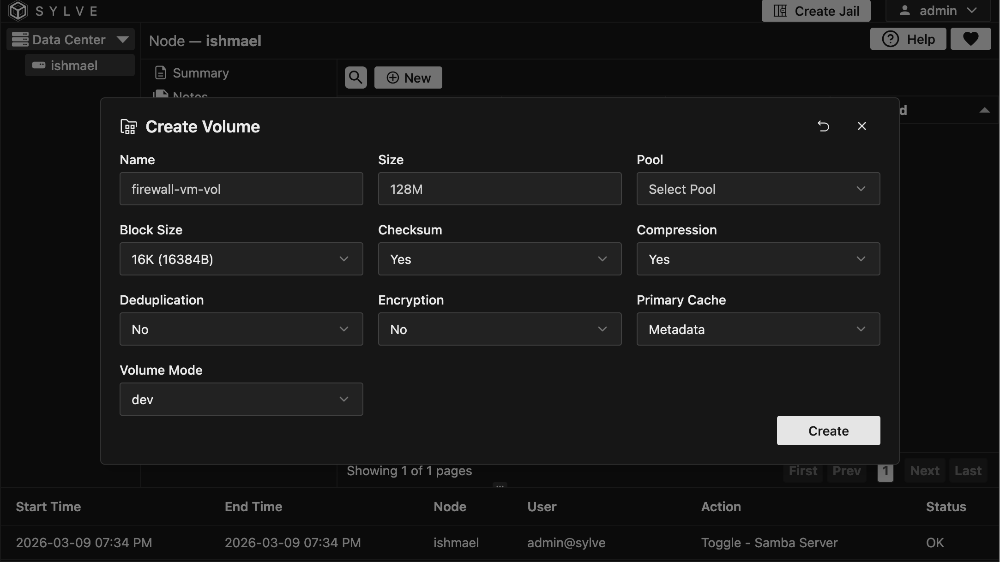
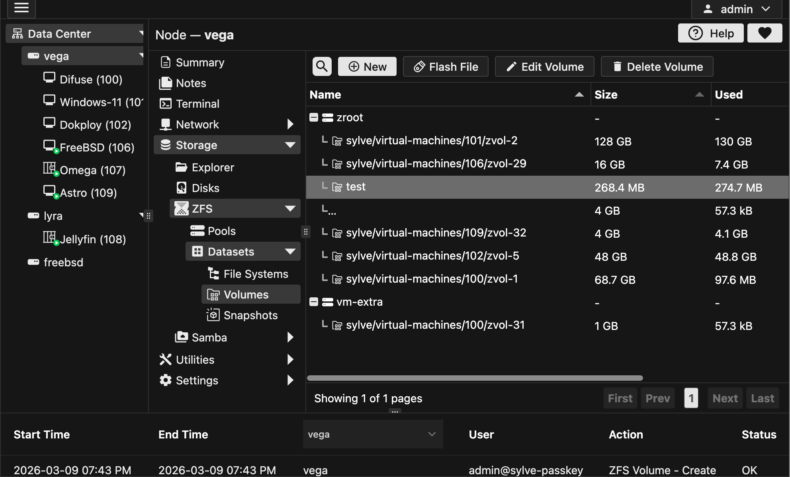
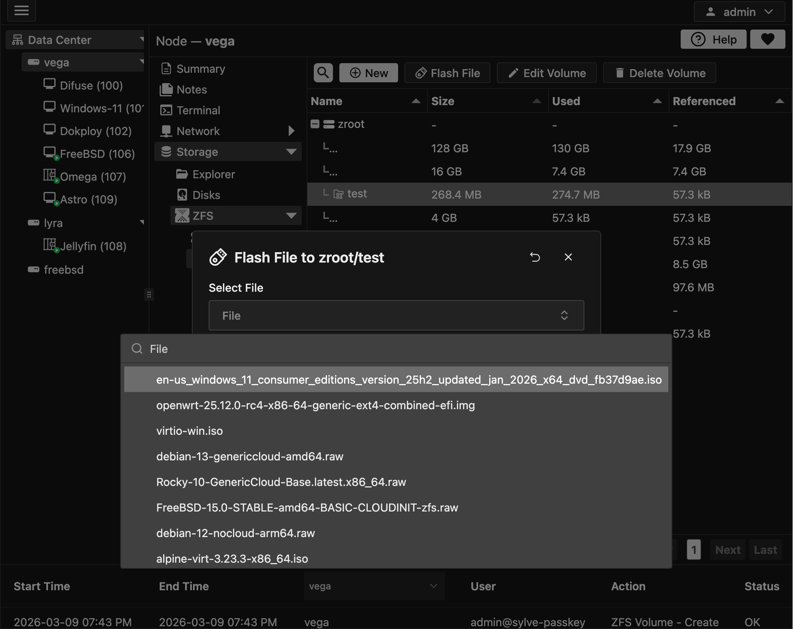

In the ZFS Volumes section, you can manage all your ZFS volumes in one place. Let's go over the various actions you can perform on your volumes.

## Create Volume

Creating a ZFS volume is a straightforward process. You can create a new volume by clicking on the "New" button in the context menu and filling out the form:

Let's go over the options:

- **Name**: This is the name of your volume. It should be unique within the pool and can be used to identify the volume later.

- **Size**: This is the size of the volume. You can specify the size in various units such as bytes, kilobytes, megabytes, gigabytes, etc.

- **Pool**: This is the pool where the volume will be created. You can choose from the available pools in your system.

:::note
When you create a volume, if it's for a VM it's highly recommended to set the Primary Cache property to "Metadata" to improve performance
:::

## Editing Volumes

You can edit the properties of an existing volume by selecting it and clicking on the "Edit" button in the context menu. This will open a form similar to the one used for creating a volume, where you can modify the properties as needed.

## Deleting Volumes

You can delete a volume by selecting it and clicking on the "Delete" button in the context menu. A confirmation dialog will appear to ensure you want to proceed with the deletion.

You can also choose to delete multiple volume datasets at once by selecting them and clicking on the "Delete Volumes" button.

## Flashing Volumes

Since ZVOLs are essentially block devices, you can flash an image file on top of them just like you would with a physical disk, this is especially useful for VMs, you can flash an ISO file on top of a ZVOL and then use that ZVOL as the boot disk for a VM.

Any ISO/IMG file downloaded using the **downloader** can be used to flash a ZVOL.