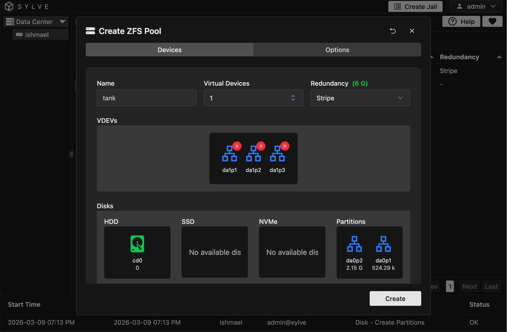
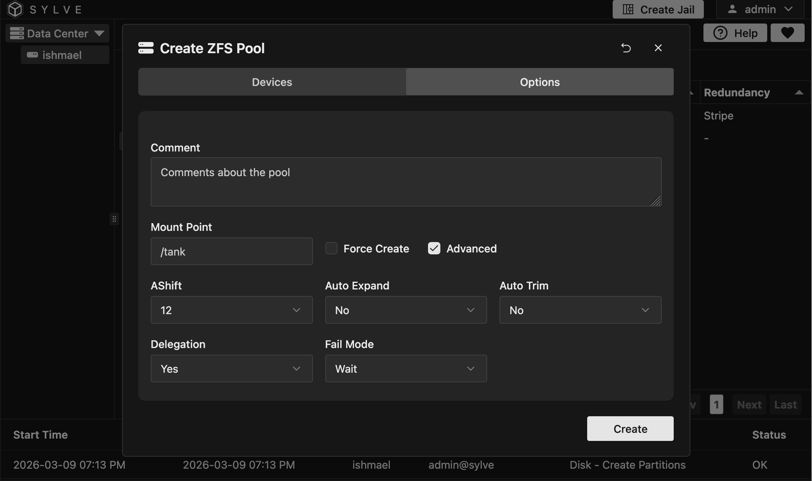
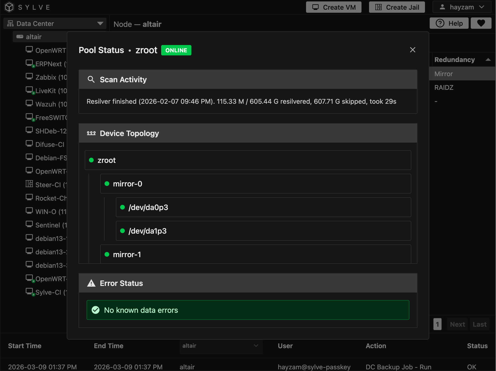
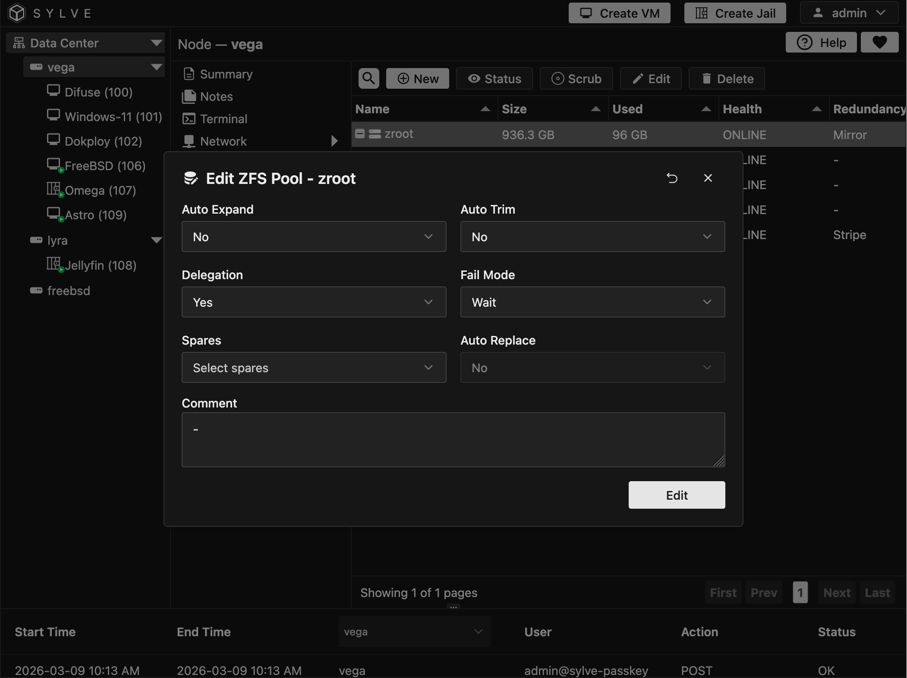

In the ZFS Pools section, you can manage all your ZFS pools in one place. You can view the details of each pool, including its name, status, size, and health. You can also perform various actions on your pools, such as creating new pools, editing existing pools to change their configuration, and deleting pools that are no longer needed. This section provides a centralized location for managing your ZFS storage pools efficiently.

We'll go through the context menu, one action at a time.

## Create Pool

There's a lot of moving parts here, so let's break it down.

- **Name**: This is the name of your pool. It should be unique and descriptive to help you identify it later. Naming [restrictions](https://docs.oracle.com/cd/E26505_01/html/E37384/gbcpt.html) apply here.

- **Virtual Devices**: This is where you specify how many VDEVs you want in your pool, in our case we're going to go with just 1 VDEV. A VDEV is a collection of physical devices that provide storage for the pool.

- **Redundancy**: Depending on the number of disks you have in your vdevs this option dynamically changes, in our case since we have 3 disks in our vdev, we can choose between Strip which lets you use all the storage but has no redundancy, Mirror which provides redundancy by mirroring data across multiple disks we get to use 1 disk's worth of storage, and RAIDZ1 which provides redundancy by using parity data we get to use 2 disks worth of storage, other options are unlocked when you have more disks in your vdevs.

In the VDEV section you can drag and drop devices from the `Disks` section.

:::note
Sometimes the modal erroneuously shows disks that are in use or disks that are invalid, such as cd0, this is a known issue and will be fixed in a future release.
:::

Now moving onto the second tab (Advanced) we can see many more options:

All of these are just ZFS props that you can set on the pool, for more information on what they do and how to use them check out the [ZFS properties documentation](https://openzfs.github.io/openzfs-docs/man/master/7/zpoolprops.7.html)

:::note
Not all properties are supported in the UI, if you need to set a property that isn't supported you can always use the CLI to set it after creating the pool.

Over the API all properties are supported, so if you need to create a pool with a property that isn't supported in the UI you can use the API to do so as well.
:::

## Pool Status

The pool status is incredibly detailed, it shows you the health of your pool, recent activity such as resilvering or scrubbing, and any errors that may have occurred. You can also see the status of each VDEV and the devices within them.

## Pool Scrubbing

Scrubbing is the process of checking the integrity of your data and repairing any errors that are found. You can start a scrub on your pool from the context menu, and you can also see the status of any ongoing scrubs in the pool status section.

:::caution
Scrubbing can be a resource-intensive process, especially on large pools, so it's best to schedule scrubs during periods of low activity to minimize the impact on performance.

When you start a scrub no a pool, to not cause any issues sylve temporarily stops you from performing any other actions on the pool until the scrub is finished, this is to prevent any potential conflicts or issues that may arise from performing other actions while a scrub is in progress.
:::

## Pool Editing & Deletion

Some pool properties can be edited as shown here:

Please refer to the [ZFS properties documentation](https://openzfs.github.io/openzfs-docs/man/master/7/zpoolprops.7.html) for more information on what each property does and how to use it.

## Deleting Pools

:::danger
Deleting a pool is a destructive action that will permanently remove all data stored in the pool. Make sure to back up any important data before proceeding with deletion.
:::

To delete a pool, simply click the delete button in the context menu and confirm the deletion. 