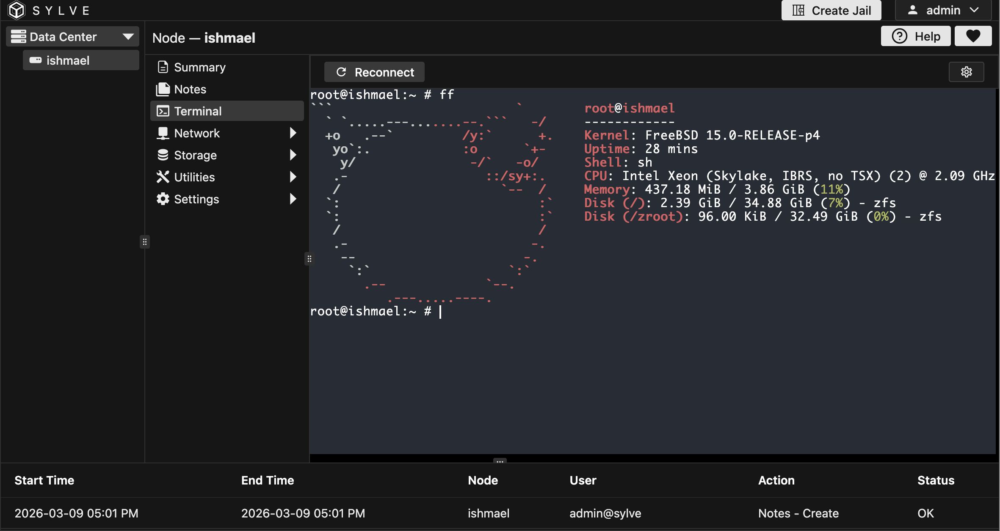

Sylve includes a web-based terminal for each node, powered by [Ghostty](https://github.com/coder/ghostty-web). This allows you to access the command line of your node directly from the Sylve interface, without needing to use SSH or other remote access tools.

