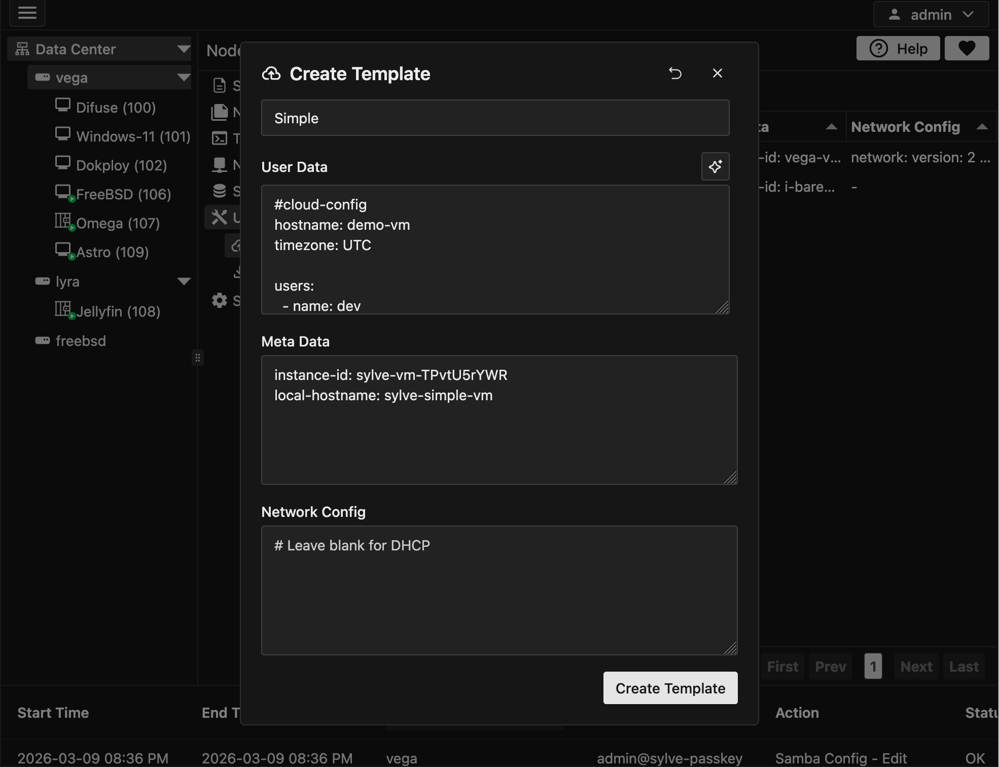
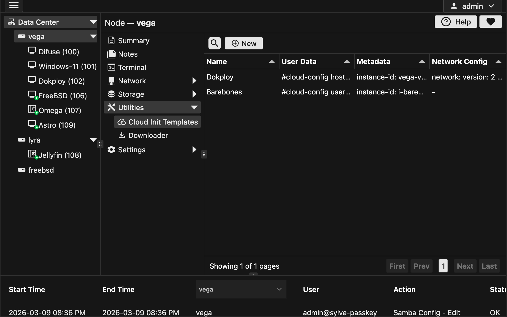

Cloud-init is a powerful tool that allows you to automate the configuration of your virtual machines (VMs) during the initial boot process. By using cloud-init templates, you can define a set of instructions that will be executed when the VM is created, making it easier to set up and manage your infrastructure.

## Creating a Cloud-Init Template

To create a cloud-init template, you can click on the "New" button in the context menu and it should open a modal like this:



You can click on the button above **User Data** to select from a preset but nonetheless the configs more or less look like this:

User Data:

```yaml
#cloud-config
hostname: demo-vm
timezone: UTC

users:
  - name: hayzam
    gecos: User
    sudo: ALL=(ALL) NOPASSWD:ALL
    shell: /bin/bash
    ssh_import_id:
      - gh:hayzamjs
    lock_passwd: true

package_update: true
package_upgrade: false

packages:
  - tmux
  - nano
  - vim
  - curl
  - wget
  - git
  - htop
  - qemu-guest-agent

ssh_pwauth: false
disable_root: true

final_message: |
  Cloud-init finished.
  User: dev
  SSH keys imported from GitHub.
```

Meta Data:

```yaml
instance-id: sylve-vm-TPvtU5rYWR
local-hostname: sylve-vm
```

You can optionally specify networking config as well:

```yaml
version: 2
ethernets:
  enp0s3:
    dhcp4: false
    addresses:
      - 192.168.0.12/24
    gateway4: 192.168.0.1
    nameservers:
      addresses:
        - 1.1.1.1
```

Leaving the network config empty will default to DHCP.

## Managing Cloud-Init Templates

Once you have created a cloud-init template, you can view and manage it from the table using the context menu. You can edit the template, delete it, or use it when creating a new VM.

