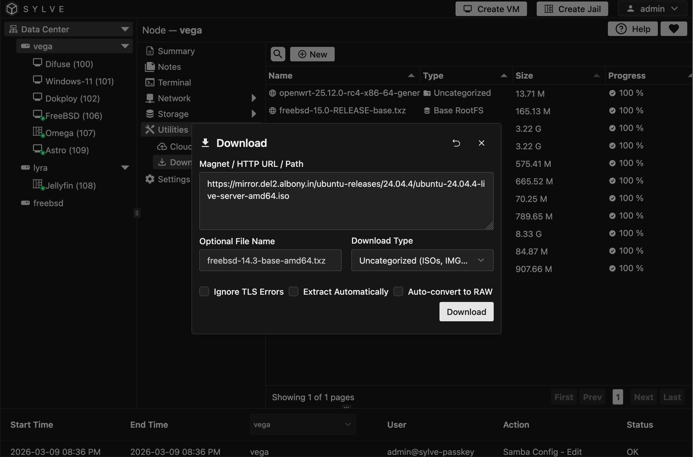

:::note
Downloads are managed by the built-in queue system, so they will be processed asynchronously in the background. You can monitor the progress of your downloads in the table.

Presently only HTTP/HTTPS downloads and path downloads support image conversion and decompressing, those actions for torrent downloads are planned for the future.
:::

## Preface

The downloader utility is a powerful tool that allows you to manage your downloads efficiently. With the downloader, you can easily add, remove, and monitor your downloads in one place. It also includes integration with a bittorrent client and also qemu-tools for on the fly conversion of disk images.

## Downloading a File

For this example, we will be downloading the latest Ubuntu Server image from the official website. To do this, we will need to click on the "New" button in the context menu and it should open a modal like this:

Let's go over the available options for this download:

- **Optional File Name**: This is the name that will be used for the downloaded file. If left blank, it will default to the name of the file being downloaded.

- **Download Type**: Setting this correctly is crucial, as it determines what this download can be used for. For general install ISOs and images, pick "Uncategorized". If you're downloading a Jail base.txz or rootfs.tar.gz, select "Base/RootFS". If you're downloading a cloud-init image, pick "Cloud-Init". If you're downloading a torrent file, select "Torrent". If you're downloading a file that should be converted to a different format, select "Path" and then select the desired output format.

- **Ignore TLS Errors**: If the source of the download has an invalid TLS certificate, you can enable this option to ignore those errors and proceed with the download.

- **Extract Automatically**: If the downloaded file is an archive (like a .txz or .tar.gz), enabling this option will automatically extract the contents after the download is complete. This is very imporatnt for Jail base.txz and rootfs.tar.gz downloads, as it will extract the filesystem that can then be used to create a new Jail.

- **Auto-Convert to RAW**: If the downloaded file is a disk image that is not in RAW format (like .qcow2 or .vmdk), enabling this option will automatically convert it to RAW format after the download is complete. This is important for any downloads that are intended to be used as VM images. We use qemu-tools underneath to do the conversion so pretty much any format that qemu supports can be converted to RAW on the fly during the download.
