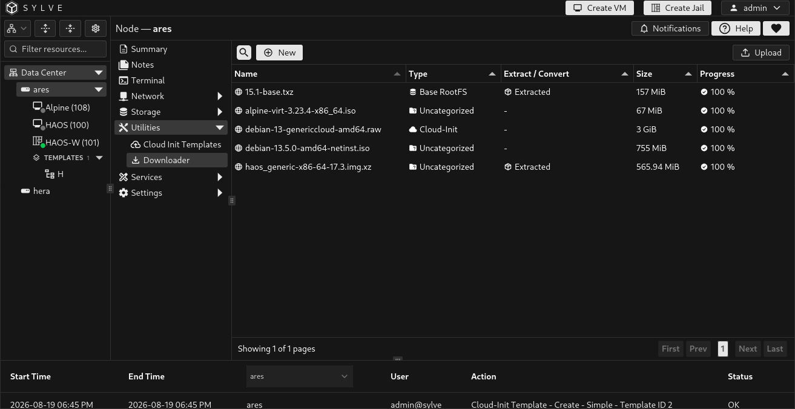
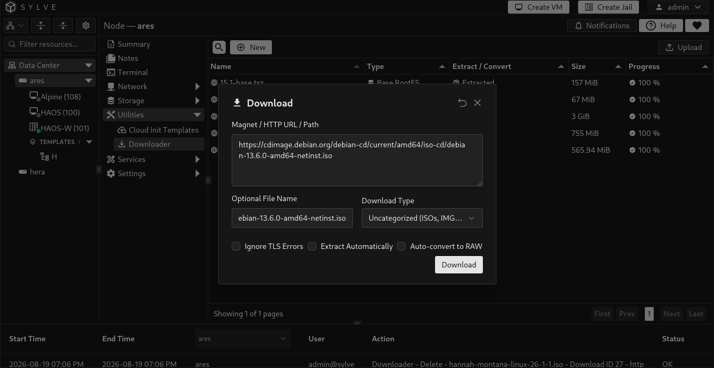
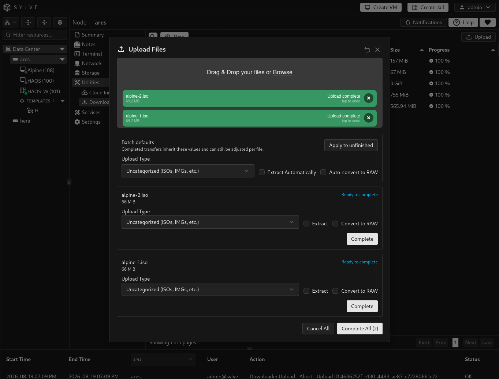

The Downloader is the node-local library for media and images used by Sylve. Add an installation ISO, a cloud-init image, a jail base archive, a disk image, or another file once, then select it from the workflows that support it.

Transfers and post-processing run in the background. The table refreshes while an item is unfinished, so it can show download progress, processing, completion, or the error returned by the source or converter.

{/* Screenshot: downloader-overview.png. Show several realistic completed and in-progress rows, including the Type, Extract / Convert, Size, and Progress columns. */}

## Choose a source

Select **New** to add a source. The same field accepts a magnet link, an HTTP or HTTPS URL, or an absolute path that already exists on the Sylve node.

{/* Screenshot: downloader-new-source.png. Show the New Download dialog with a realistic HTTPS URL and the options below it. */}

| Source | Use it for | What Sylve does |
| --- | --- | --- |
| **HTTP or HTTPS URL** | Downloading a file from a web server, such as an ISO or a VM image. | Retrieves the file into the Downloader library. You may provide a destination filename and enable post-processing. |
| **Magnet link** | Fetching a multi-file torrent, such as a distribution image. | Starts a BitTorrent transfer. Sylve adds its tracker list to the magnet link. Torrent entries can be viewed, but their source, name, and processing settings cannot be edited in the Downloader. |
| **Absolute path** | Bringing an existing regular file on the node into the Downloader library. | Copies the source file into the library. The source must be readable and must be a file, not a directory. |
| **Upload** | Sending files from the computer running your browser to the node. | Stages the upload first, then adds it to the same background Downloader workflow as any other source. |

For an HTTP(S) source or a server-local path, **Optional File Name** controls the filename in the Downloader library. If it is blank, Sylve derives a name from the URL or path. Use a plain filename only, without directories.

### Understand Download Type

**Download Type** classifies a completed item for other Sylve forms. It does not change the protocol used to retrieve the file.

| Download Type | Choose it when | Where it matters |
| --- | --- | --- |
| **Uncategorized (ISOs, IMGs, etc.)** | The file is general-purpose installation media, a disk image, or something with no special Sylve role. | Suitable for ordinary ISO and image selection workflows. |
| **Base / RootFS** | The file contains a jail base system or root filesystem. | Makes the item available as jail base or root filesystem media. Selecting it automatically enables extraction. |
| **Cloud-Init** | The file is a cloud-init capable VM image. | Makes the image eligible for a VM's Cloud-Init media selection. A regular **Base / RootFS** or **Uncategorized** download cannot be used for that VM option. |

:::tip
For a VM image that needs Cloud-Init, select **Cloud-Init** when you add or upload it. The image must also be a cloud-init enabled operating-system image from its publisher, not merely an arbitrary ISO or disk image.
:::

### Transfer and processing options

| Option | Available for | Effect |
| --- | --- | --- |
| **Ignore TLS Errors** | HTTP(S) sources | Continues even when the remote server's TLS certificate cannot be verified. Leave this off unless you understand and trust the source despite its certificate problem. |
| **Extract Automatically** | HTTP(S), node-local paths, and uploads | Extracts a tar archive or decompresses a supported compressed file after the file arrives. Base / RootFS enables this automatically. |
| **Auto-convert to RAW** | HTTP(S), node-local paths, and uploads | Converts a disk image to RAW using `qemu-img`. This is useful when an image is supplied as a format such as qcow2 or VMDK and the next workflow expects a RAW disk image. |

Automatic extraction and RAW conversion can be enabled together for a compressed disk image. Sylve decompresses it first and converts the resulting image. Do not enable both for a tar archive such as `.tar`, `.tar.gz`, `.txz`, or `.tar.zst`: a tar archive is extracted as files and cannot be converted to a RAW disk image.

Torrent downloads do not support automatic extraction or RAW conversion. Download the torrent as-is, or obtain the image by HTTP(S), local path, or upload when post-processing is required.

## Add a web, magnet, or local-path source

1. Open **Utilities → Downloader** and select **New**.
2. Paste a magnet link, an HTTP(S) URL, or the absolute path to a readable file on this node.
3. For an HTTP(S) or path source, optionally set a filename, then choose its **Download Type**.
4. Enable extraction or RAW conversion only when the file and intended use call for it.
5. Select **Download**.

The new row is accepted as **Pending**. It moves through transfer and post-processing without keeping the dialog open.

| Table state | Meaning |
| --- | --- |
| **Pending** | Sylve accepted the item and has queued its work. |
| **Processing** | The transfer or its extraction/conversion work is running. |
| **Done** | The item is ready for selection by supported Sylve workflows. |
| **Failed** | The transfer or processing step stopped. Select the row's progress cell to copy the reported error, correct the source or option, and add it again if needed. |

## Upload files from your computer

Select **Upload** in the upper-right corner. You can add multiple browser-local files to one staging queue. An upload is not yet a Downloader item until you complete it.

{/* Screenshot: downloader-upload-stage.png. Show multiple uploaded files in the staging queue, batch defaults, per-file options, and the Complete All action. */}

1. Drop files into the upload area or browse for them.
2. Set **Batch defaults** for the group, then select **Apply to unfinished** if you want to copy those choices to every staged file.
3. Review or change the **Upload Type**, extraction, and RAW conversion options for each individual file.
4. Select **Complete** for one item or **Complete All** for every valid staged item.

The browser transfer and completion are separate steps. This lets you classify and process each uploaded file before it enters the library. You can cancel unfinished items. Closing the dialog also clears unfinished staged uploads; files already completed remain in the Downloader.

:::note
Uploaded files are staged temporarily before completion. Complete an upload while you are working, rather than treating staging as permanent storage.
:::

### Upload limits

Browser uploads use the node's `uploads` section in `config.json`. These limits are enforced by the server, so changing browser behavior cannot bypass them.

| `config.json` setting | Default | Effect |
| --- | --- | --- |
| `uploads.maxFileBytes` | `68719476736` bytes, or 64 GiB | Maximum size of each uploaded file. The multipart request has a small additional allowance for upload metadata. |
| `uploads.maxConcurrentTransfers` | `2` | Maximum number of upload transfers that the node accepts at once. This shared limit covers both Downloader uploads and File Explorer uploads. Further transfers wait for capacity and may need to be retried. |

Set both values to positive integers. When a value is omitted or set to zero, Sylve uses its default. Consider available disk space in the node's data path as well as the final image size, since a file is staged before it is completed into the Downloader library.

## Reuse and manage completed items

Select a completed item in the table to reveal the available actions.

| Action | Availability | Result |
| --- | --- | --- |
| **Download** | A completed HTTP, local-path, uploaded, or individual torrent file row | Downloads that file to the computer running your browser. |
| **Copy URL** | The same completed selections as Download | Copies a short-lived, signed browser download URL. Treat it as temporary access. |
| **Edit** | Completed HTTP, local-path, and uploaded items | Change the display name, Download Type, and unfinished processing options. Enabling extraction or conversion later queues processing again. The source URL cannot be changed. |
| **View** | Torrent entries | Shows the torrent's name and magnet link. |
| **Delete** | One or more top-level items | Removes the Downloader record and its managed data after safety checks. |

For torrents containing several files, expand the top-level row and select the individual child file before using **Download** or **Copy URL**.

### Delete safely

Sylve refuses to delete an item while it is pending or processing. It also refuses deletion when a VM currently references that download, or when it cannot safely prove which managed files belong to the entry. These checks prevent a cleanup action from removing media that a VM still needs or unrelated files on the node.

Detach or replace any VM media that references the item, wait for active work to finish, then try deletion again. If the table reports retained paths after an unsuccessful cleanup, review those paths on the node before making manual changes.

## Practical examples

| Goal | Source and settings |
| --- | --- |
| Boot a VM from a FreeBSD or Linux installer | Use the publisher's HTTPS ISO URL. Choose **Uncategorized** and leave processing disabled. |
| Create a VM from a cloud image with first-boot configuration | Add the publisher's cloud image by HTTPS or upload it. Choose **Cloud-Init** and enable **Auto-convert to RAW** if the source is not already RAW. |
| Create a jail from a base archive | Add the base archive by HTTPS, local path, or upload. Choose **Base / RootFS**. Extraction is enabled automatically. |
| Reuse an image already on the node | Enter the file's absolute node path, choose the appropriate type, and optionally process it. Sylve copies it into its managed library. |
