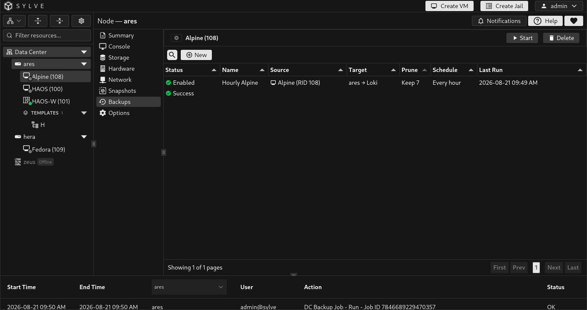
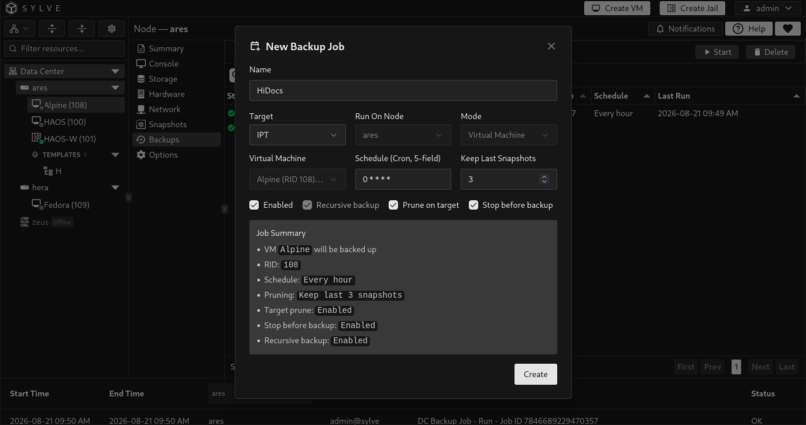
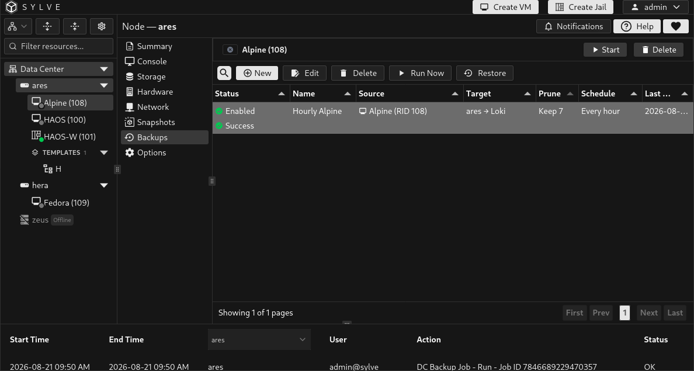
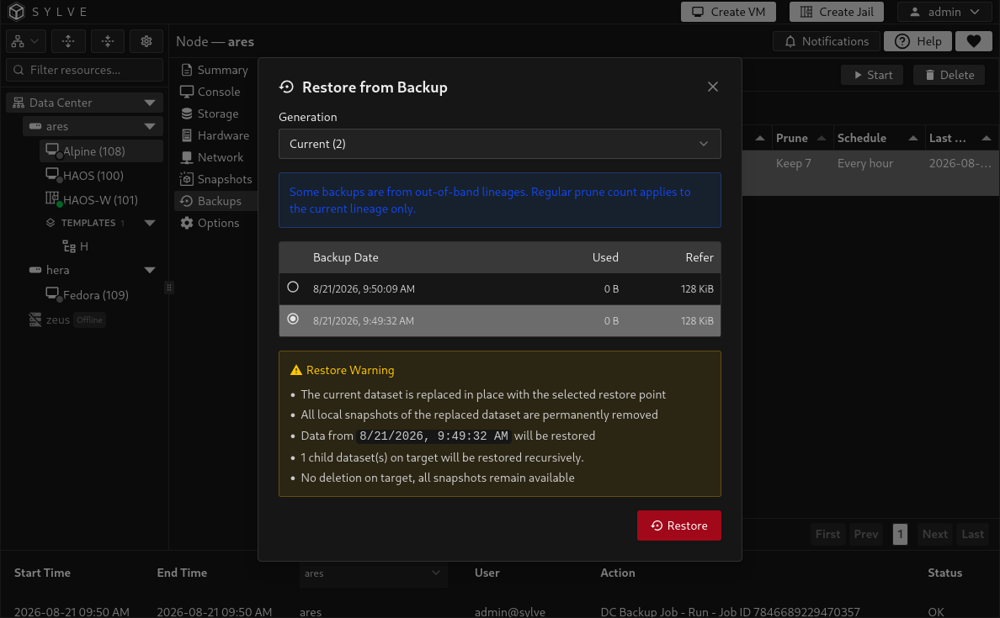

The **Backups** tab is the VM-scoped view of Data Center backup jobs. It shows only jobs that protect this VM, while retaining the same job actions and restore workflow. Use it to create a VM backup policy without having to find the guest again in the cluster-wide list.

Before creating a job, add and validate a remote [backup target](/guides/data-center/backups/targets/). A backup is a separate recovery copy, unlike a local [VM snapshot](/guides/node/virtual-machines/snapshots/) that remains on the node's storage.

## Create a VM backup job

Select **New**. Because you opened the tab from a VM, Sylve fixes the source to the current VM and uses its current owner as the runner. Select the target, name the job, choose its schedule and retention, then save it.

| Field | Description |
| --- | --- |
| **Name** | A name that identifies this VM's backup policy. |
| **Target** | The validated remote target that receives the backup data. |
| **Run On Node** | The VM's current owner. This is selected automatically because backups must run where the VM currently lives. |
| **Schedule (Cron, 5-field)** | When the job runs, for example `0 2 * * *` for 02:00 every day. |
| **Keep Last Snapshots** | Number of backup recovery points to retain. Set `0` to disable count-based retention. |
| **Enabled** | Saves the policy without scheduling it when unchecked. |
| **Recursive backup** | Required for VM jobs. It includes every child disk dataset belonging to the VM. |
| **Prune on target** | Applies the retention count to backup copies stored on the target. |
| **Stop before backup** | Stops the VM before the backup and starts it again afterward. |

### Consistency and downtime

With **Stop before backup** disabled, the backup captures the running guest's ZFS state without quiescing applications. This avoids backup downtime but applications inside the VM should be able to recover from a crash-consistent copy.

Enable **Stop before backup** when you need an offline, application-consistent backup and the planned downtime is acceptable. For database or other write-heavy workloads, this is often the simpler and safer choice unless the guest handles its own backup consistency.

## What a VM job protects

Sylve discovers every managed ZFS storage root belonging to the VM, including storage on different pools, and commits them as one backup generation. Child disk datasets are included automatically, which is why recursive backup is mandatory for VM jobs.

The backup does not flatten a multi-pool VM into one dataset. A complete generation is restorable only when every recorded VM storage root is present on the target.

:::note
The VM's **name** and **RID** are its identity in the policy. If the VM moves to another node through a supported migration or failover workflow, Sylve updates its runner through that workflow. Do not create a second policy merely because its owner changed.
:::

## Run and monitor a job

Select a job to expose its actions.

| Action | Result |
| --- | --- |
| **Run Now** | Queues an immediate backup without changing the cron schedule. |
| **Edit** | Changes policy settings such as the name, schedule, enabled state, retention, pruning, and stop-before-backup behavior. |
| **Restore** | Opens recovery-point selection for this job. |
| **Error** | Opens the full error text when the last run failed. |
| **Delete** | Removes the job definition but leaves existing data on the backup target. |

Jobs with **Runner rebind pending** or **Repair required** need their ownership or placement workflow repaired before they can run or restore. Use the [backup events](/guides/data-center/backups/events/) page for a complete run history and progress details.

## Restore this VM

Select a job, choose **Restore**, then select the desired generation and snapshot. Encrypted sources require the relevant encryption passphrase during restore.

For a VM with storage on more than one pool, Sylve preflights every destination before changing data and restores the complete root set as a coordinated operation. If a later root or VM metadata reconciliation fails, it rolls back roots already restored where possible.

:::caution
When restoring a multi-pool VM as a new VM, the selected root moves to the chosen destination pool, but additional storage roots retain their original pool names. Those pools must exist on the restore node. Sylve does not currently consolidate every disk into the selected destination pool.
:::

For recovery onto another node, dataset, or target path, use **OOB Restore** from [Data Center → Backups → Jobs](/guides/data-center/backups/jobs/).

