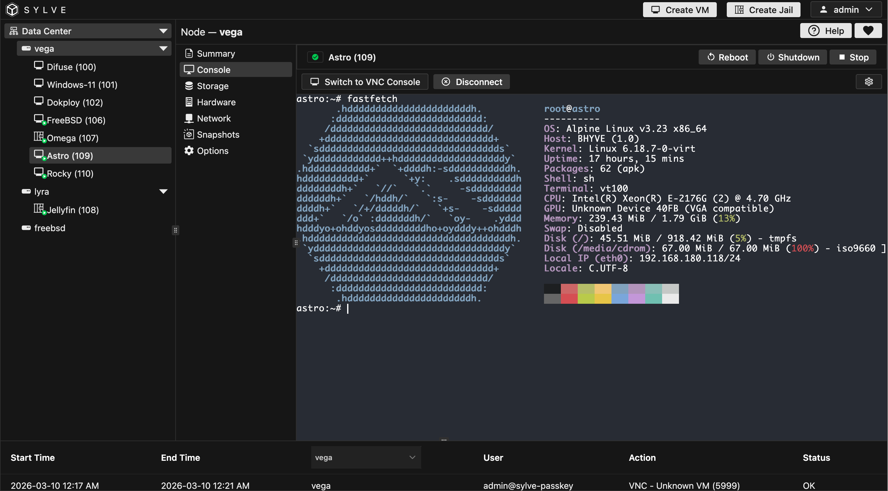
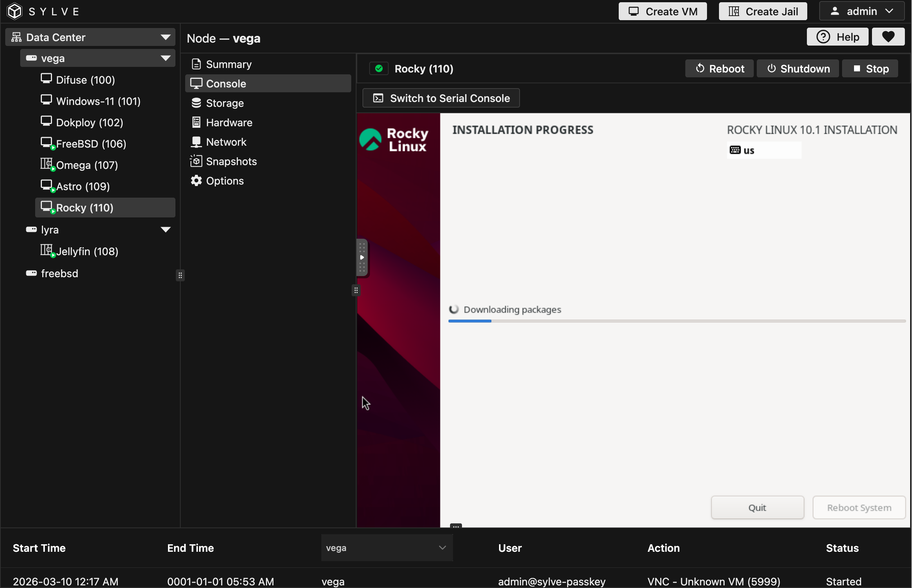

:::caution
The terminal requires a secure context (HTTPS) to function. Sylve automatically configures HTTPS for your nodes, so no additional setup is needed. However, if you access Sylve over HTTP, the terminal will not work. Ensure you are using HTTPS when accessing Sylve.
:::

The Serial console is a text-based interface that allows you to interact with your VM's operating system directly. It's useful for troubleshooting and performing tasks that require command-line access. It also supports copy-pasting, making it easier to execute commands without typing them out.

VNC on the other hand provides a graphical interface to your VM, allowing you to interact with it as if you were sitting in front of it. This is particularly useful for operating systems that have a graphical user interface (GUI) or for tasks that are easier to perform with a mouse and keyboard.

You can seemlessly switch between the Serial and VNC consoles, with a single click, allowing you to choose the best interface for your current task. Whether you need to troubleshoot a boot issue with the Serial console or manage your VM's GUI with VNC, the Console section provides you with the tools you need to effectively manage your virtual machine.