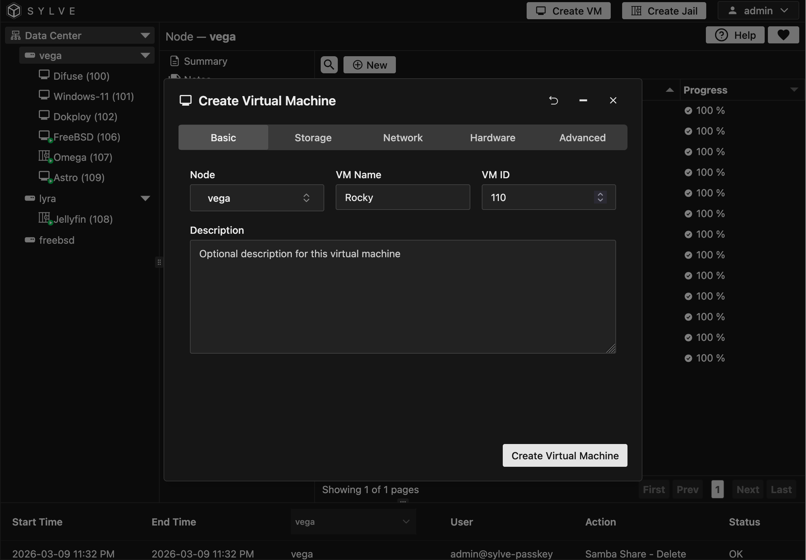
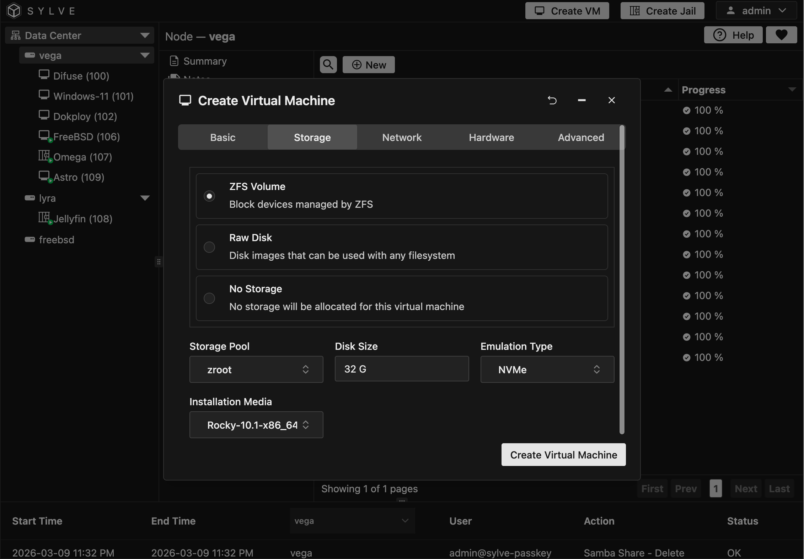
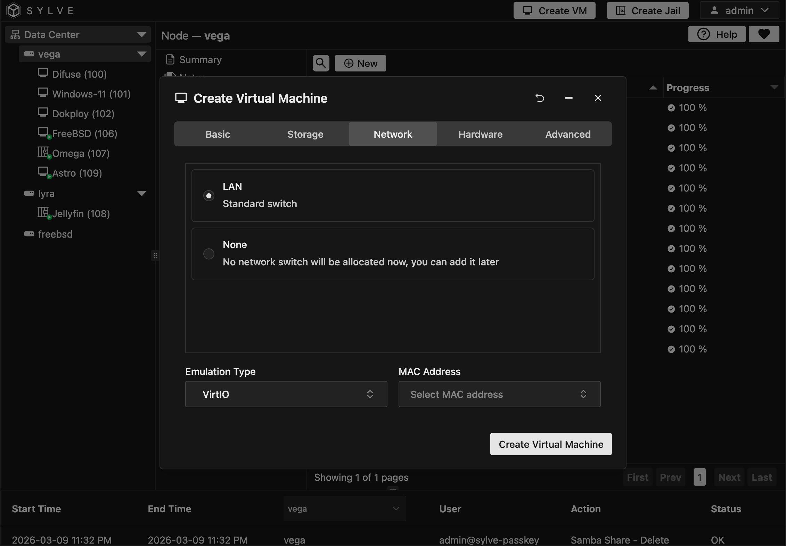
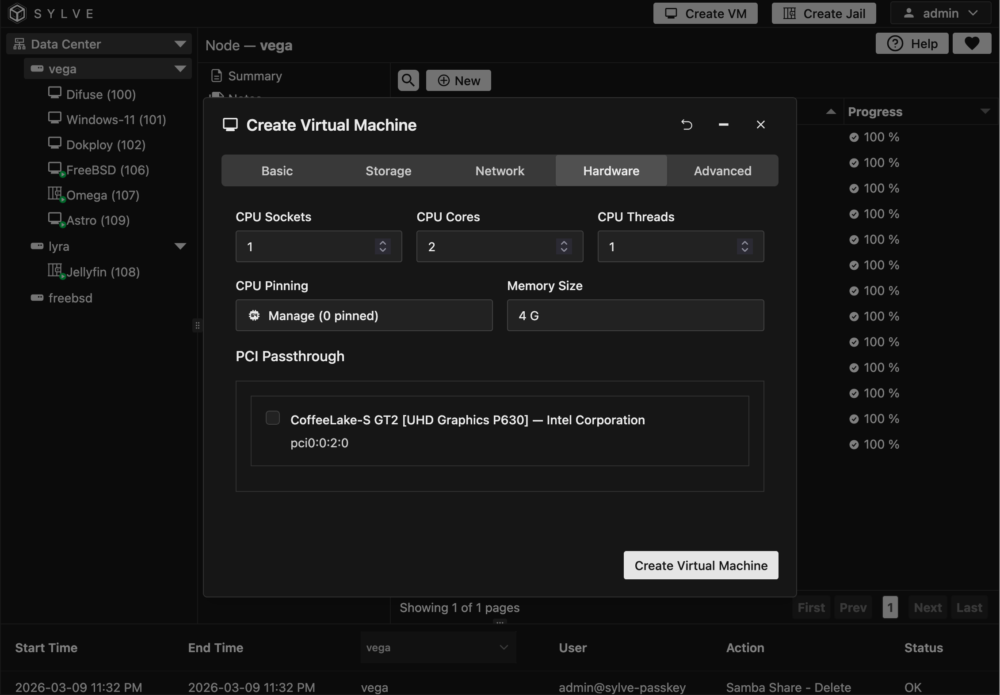
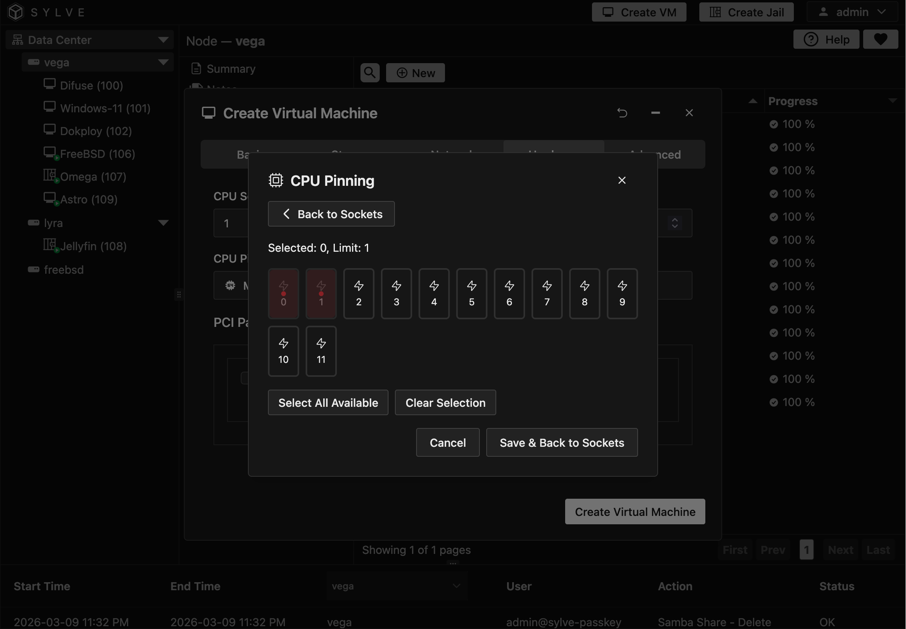
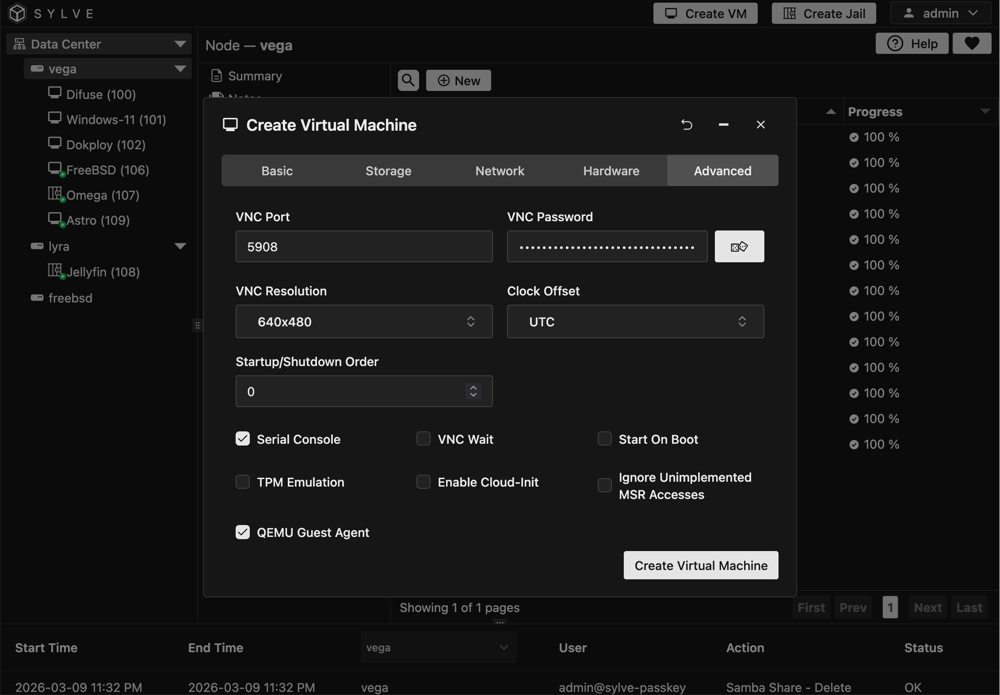
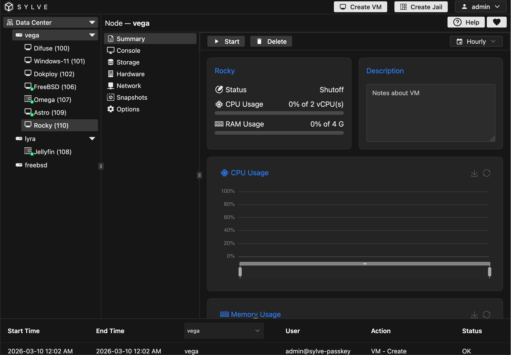

:::note
Your node needs to have the Virtualization service toggled, else you will not even see the **Create VM** button on the top right corner of the app.
:::

To create a virtual machine, click on the **Create VM** button on the top right corner of the app. This will open a form where you can enter the details of your virtual machine.

For this example we're going to be setting up a simple Rocky Linux 10 virtual machine with 2 vCPUs, 4 GB of RAM and a 32 GB disk. You can adjust these values to fit your needs.

## Basic Information

In the **Basic** tab, there are a few fields that you need to fill out:

- **Node**: The node this virtual machine belongs to, this select box will only show up if you're in a cluster.

- **VM Name**: Name for the VM you're about to create

- **VM ID**: This is a number between 1-9999, it **HAS** to be unique cluster-wide, if you are clustered that is.

- **Description**: An optional description for the VM you are about to create.

## Storage

As far as storage goes, you have 3 options:

1. ZFS volume (Highly recommended)
2. Raw Disk
3. No Storage

:::note
If you select **No Storage** you will have to attach a storage media later in the lifecycle of the VM.
:::

We always use ZFS Volumes, even with disk images that come from other hypervisors, we flash them using our ZFS volume image flasher and then use them that way, the speed difference between using a ZFS volume and a raw disk is negligible, and the benefits of using ZFS volumes are huge, such as snapshots, clones, compression and more.

For emulation type we've had the best experience with NVMe emulation, VirtIO is also pretty good but AHCI-HD should only be used if you have a very specific use case for it, such as running a very very old OS or something of that sort, always default to NVMe, with Bhyve that seems to offer the best performance, almost near native.

For installation media, we're going to pick an ISO image we downloaded from rockylinux.org, you can also use a cloud-init image if you want to create a cloud-init enabled VM, but for this example we're going to use a regular ISO image and then install the OS manually.

If you want to proceed without selecting any installation media you can do that by explicitly selecting the "None" option.

## Network

You can attach your VM to a switch at this stage, if you select none you can always attach it later, but if you want your VM to have network connectivity as soon as it's created, you need to select a switch here. This is especially important if you are creating a cloud-init enabled VM, as cloud-init will need network connectivity to do its thing on first boot.

For emulation type it's good to use VirtIO, it offers good performance and is widely supported by most operating systems, but some Operating Systems like Windows don't support it out of the box without drivers, so in those cases you might want to use E1000, but for Linux/FreeBSD based OSes VirtIO is usually the way to go.

If you have a MAC address that was previously created select that here else just leave it blank and Sylve will generate a random one for you.

## Hardware

This is where you can configure the hardware resources for your VM, such as the number of vCPUs, amount of RAM and more.

We usually keep the topology like this: 1 Socket, `n` Cores and 1 Thread, where `n` is the number of vCPUs we want to assign to the VM, this is not a hard rule but it seems to work well in most cases, with Linux, Windows and FreeBSD based VMs, but feel free to experiment with different topologies and see what works best for your specific use case.

Next comes CPU Pinning and Memory Size.

You can select a Socket and cores within that socket to pin, it's always good to pin cores that are close to each other in succession, for example if you have a CPU with 16 cores, it's good to pin cores 0-3 for one VM, 4-7 for another VM and so on, this way you can take advantage of the CPU cache and reduce latency.

For memory size, you can select the amount of RAM you want to assign to the VM, it's always good to assign a little bit more RAM than you think you need, especially if you're going to be running a desktop environment on the VM, but keep in mind that assigning too much RAM can lead to performance issues on the host, so it's a good idea to find a balance that works for your specific use case.

:::danger
Never ever overcommit your RAM, if you have 16 GB of RAM on your host, a good rule of thumb is to always leave 4 GB to the hypervisor as a buffer, so in that case you should never assign more than 12 GB of RAM to your VMs, this is especially important if you're going to be running multiple VMs on the same host, as overcommitting RAM can lead to severe performance issues and even crashes.
:::

PCI Passthrough is also available in the same page. If you had enabled it in your System settings they should show up here, you can passthrough the same PCI device to multiple VMs if you want, but keep in mind that **only one** VM will be able to use it at a time

## Advanced

Now this page has a lot of goodies, let's go through all of them:

- **VNC Port and Password**: This is pretty self-explanatory, you can set a custom VNC password field to generate a strong random password.

- **VNC Resolution**: You can set a custom VNC resolution for your VM, this is especially useful if you're going to be running a desktop environment on the VM, but keep in mind that setting a very high resolution can lead to performance issues on the host, so it's a good idea to find a balance that works for your specific use case.

- **Clock Offset**: You can choose either UTC or Local Time for your VM, for windows guests it's usually better to use Local Time, while for Linux/FreeBSD based guests it's usually better to use UTC.

- **Startup/Shutdown Order**: This is the order number in which your VM will start/shutdown (If start on boot is enabled)

- **TPM Emulation**: Emulate a TPM 2.0 module using swtpm, this is required for Windows 11 and newer guests (Ubuntu also supports it).

- **Serial Console**: This option let's you connect to a TTY on the guest to get serial access, this is really cool as it allows for seamless copy and paste.

- **Enable Cloud-Init**: This will enable cloud-init on the guest, allowing you to do all sorts of cool stuff like setting up users, running scripts on first boot and more, this is especially useful for headless VMs that you want to set up without having to VNC into them. You can use the template you created earlier or type in manually in the textboxes that open below the checkboxes.

- **VNC Wait**: Enabling this option will make the VM wait for a connection to the VNC framebuffer before continuing the startup.

- **Ignore Unimplemented MSR Accesses**: Toggling this would mean the hypervisor silently ignores guest attempts to read or write Model Specific Registers (MSRs) that the hypervisor does not implement, instead of triggering a fault or stopping the virtual machine.

- **QEMU Guest Agent**: This will run a separate socket to connect to the agent running on the guest to get cool stats like OS information and IP addresses and such. Very useful if you have an upstream DHCP router and have no idea what IP you got. This will let you see it in the UI without having to VNC/Serial into it.

After the VM creation is successful you can go to the VM's page by clicking on it in the sidebar and reach the summary page, like this:

