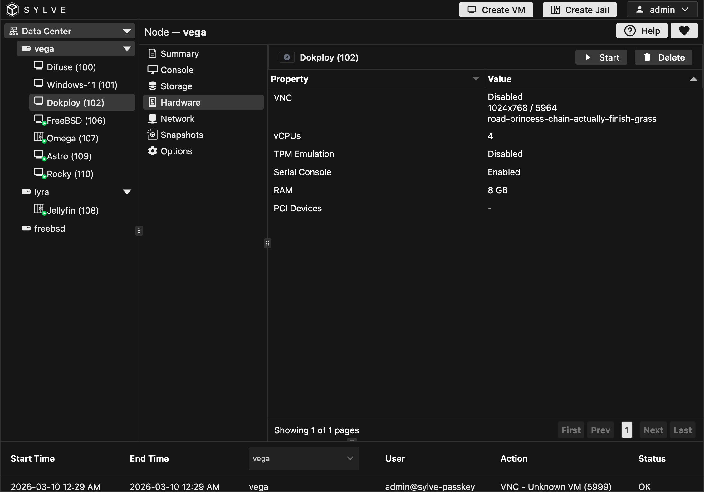

In the Hardware section, you can manage your VM's hardware settings, including CPU, memory, and other resources. You can adjust these settings as needed to optimize your VM's performance.

:::note
Clicking on the VNC properties value copies it to your clip baord if you want to use an external VNC client to access it easily
:::

:::caution
It is not wise to disable TPM emulation once you have enabled it, VMs especially windows behave very weirdly/stops working completely if you do.
:::