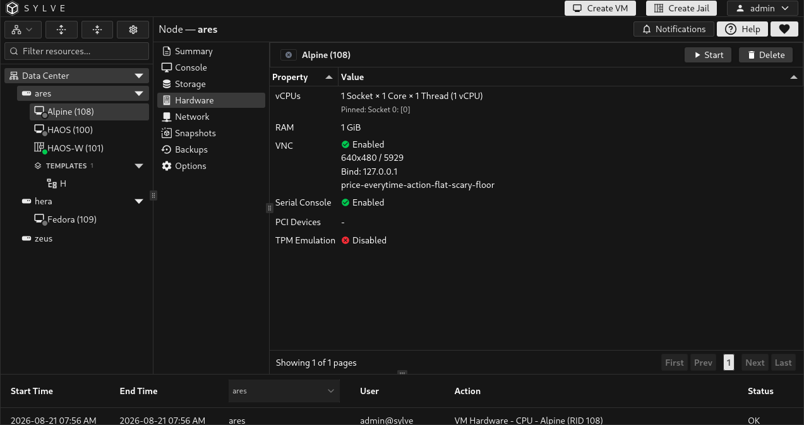
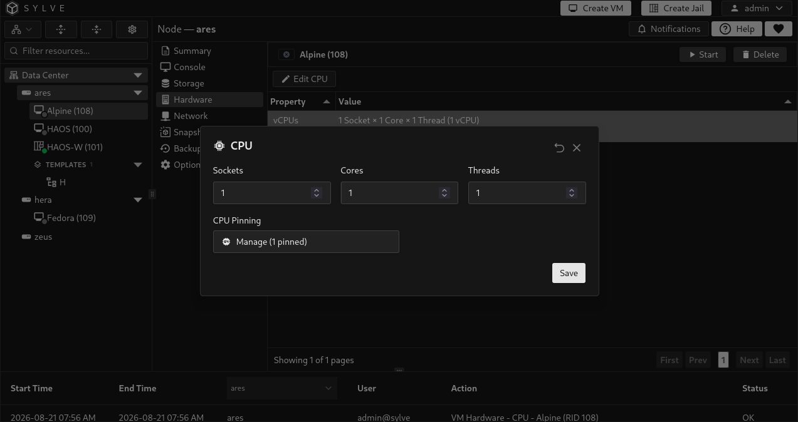
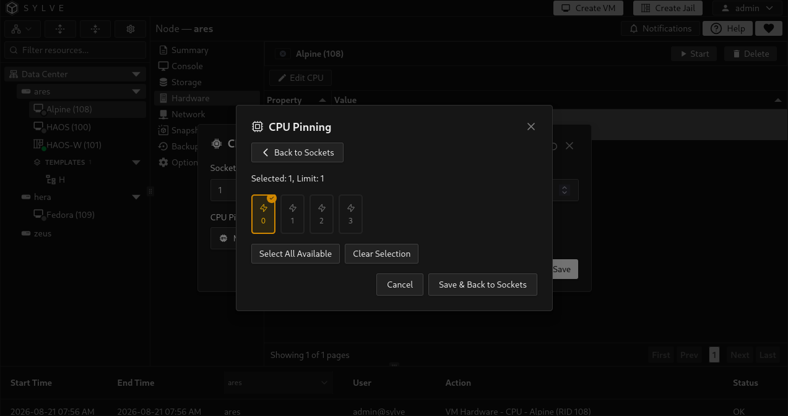
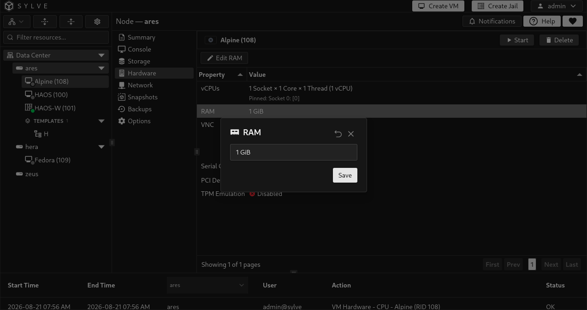
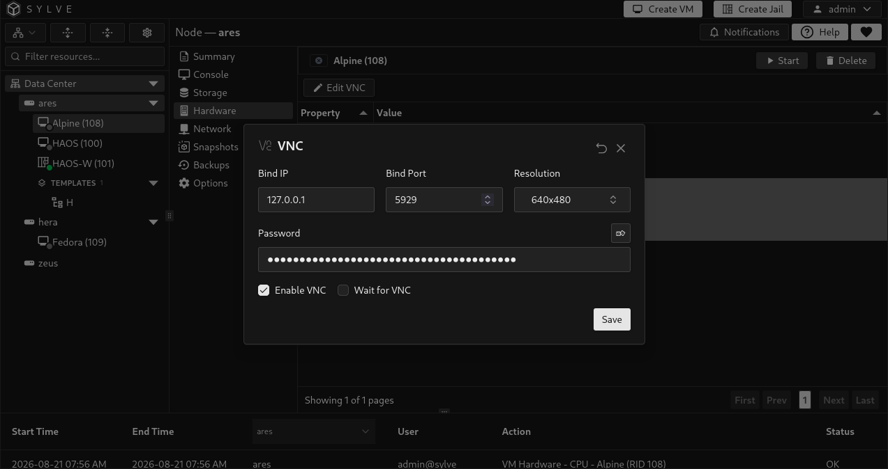
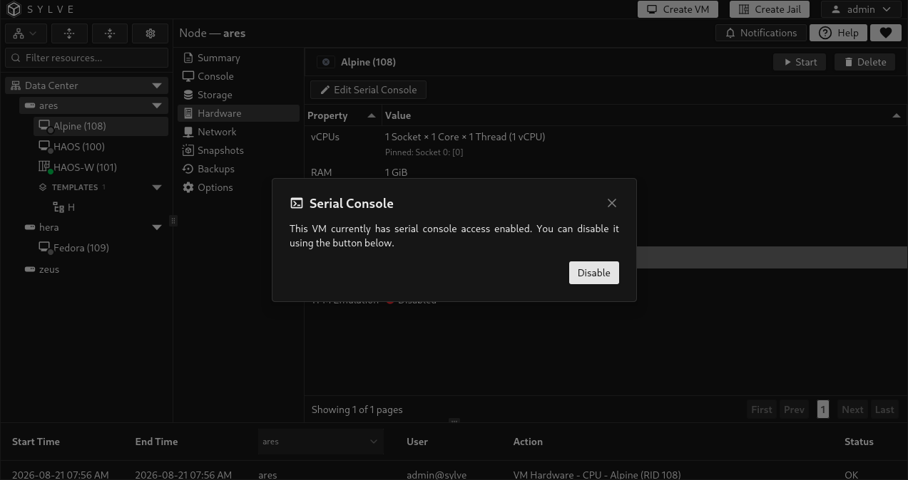
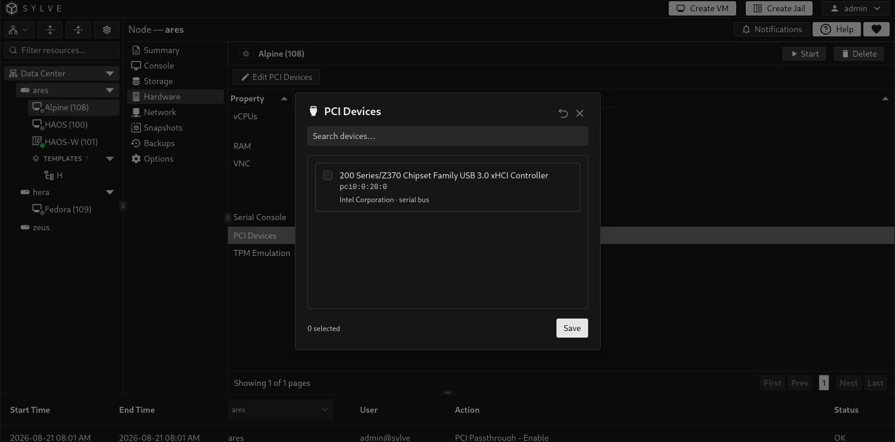
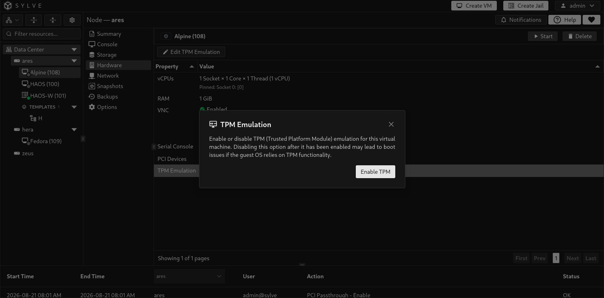

The **Hardware** tab controls the virtual hardware presented to a VM: CPU topology and pinning, memory, remote console access, PCI passthrough, and TPM emulation.

:::caution
Shut the VM down before making hardware changes. Sylve disables the edit action while the VM is running and the backend also rejects hardware changes unless the VM is fully stopped.
:::

## Hardware overview

Select an entry in the table, then choose **Edit** to open its configuration. The table is also a quick view of the VM's current topology and enabled capabilities.

| Entry | What it controls |
| --- | --- |
| **vCPUs** | CPU topology and optional pinning of guest vCPUs to host logical CPUs. |
| **RAM** | The memory allocated to the VM. |
| **VNC** | The graphical console listener, its bind address, port, resolution, and password. |
| **Serial Console** | Whether Sylve presents a serial device to the guest. |
| **PCI Devices** | Prepared PCI devices passed directly through to the VM. |
| **TPM Emulation** | A virtual Trusted Platform Module for guests that require TPM features. |

## CPU and memory

### CPU topology and pinning

Set the number of **sockets**, **cores**, and **threads**. Their product is the total number of vCPUs presented to the guest. For example, `1 × 4 × 2` presents eight vCPUs.

Optionally choose host logical CPUs in **CPU Selector** to pin individual guest vCPUs. Pinning is useful for workloads that need predictable CPU placement. Sylve validates the selected topology and rejects duplicate pins, pins outside the host CPU range, pin counts larger than the VM's vCPU count, and pins already reserved by another VM.

#### Configure the topology

#### Pin guest vCPUs

### Memory

RAM is configured in MiB. Sylve requires at least 128 MiB and the UI prevents an allocation that would leave less than 1 GiB available to the host. Treat that as a minimum guardrail, not a sizing recommendation. FreeBSD, ZFS, and other services need memory too, especially on nodes with active ARC caching or several running VMs.

## Console hardware

### VNC

Enable VNC to give the VM a graphical console. Choose an IPv4 or IPv6 **Bind IP**, a port from `5900` to `65535`, a resolution, and optionally a password. Sylve checks the selected port against other VMs and against host TCP listeners before saving it.

**Wait for VNC** makes the guest wait for a VNC client connection before continuing. This is useful when you need to observe early boot or an installer.

The VNC value in the Hardware table is clickable. Select it to copy a VNC connection URI for an external client. If you configured a password, the copied URI includes it, so handle the clipboard contents as sensitive.

For using the in-browser graphical or serial console, see [Console](/guides/node/virtual-machines/console/).

### Serial console

Enable **Serial Console** to add a serial device to the VM. The guest operating system must also be configured to send a login prompt and kernel output to that device. Once the guest is ready, open the serial console from the [Console](/guides/node/virtual-machines/console/) tab.

## PCI passthrough

PCI passthrough gives a VM direct access to a prepared physical device, such as a GPU, NIC, storage controller, or USB controller. First prepare the device under [PCI Passthrough](/guides/node/settings/system/pci-passthrough/), restart the node as recommended there, then select it here.

The picker identifies devices that are already assigned to another VM. A device assigned to a stopped VM can be reassigned after you remove it from that VM. A device in use by a running VM cannot be used elsewhere, and Sylve prevents the conflicting VM from starting.

## TPM emulation

Enable **TPM Emulation** when the guest requires a TPM, for example for an operating-system feature that stores credentials or encryption state in TPM-backed storage.

:::caution
Do not disable TPM emulation casually after the guest has started using it. A guest that has enrolled keys, encryption protectors, or boot state with the virtual TPM can fail to boot or require recovery after it is removed.
:::

