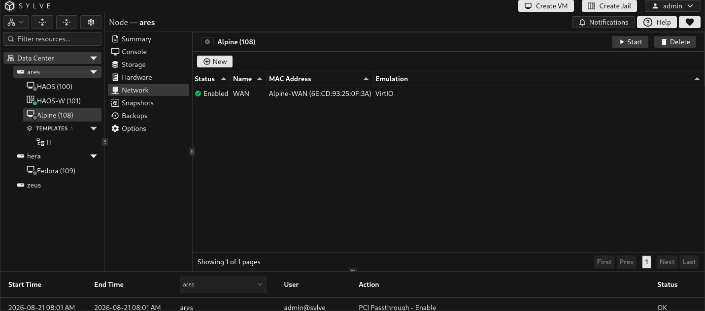
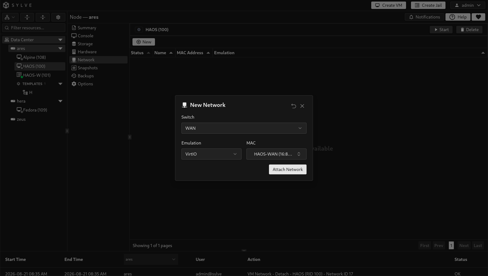
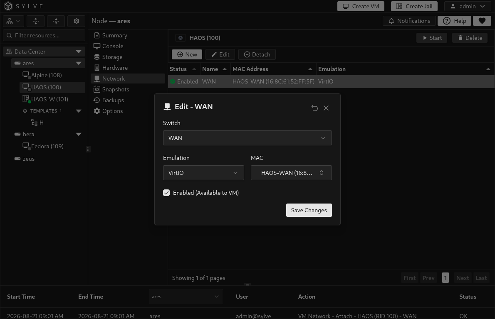
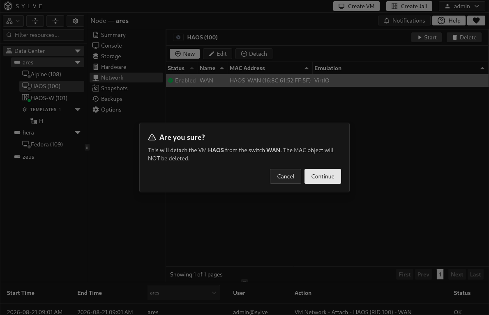

The **Network** tab manages the virtual network interfaces connected to a VM. Each interface connects the guest to a Sylve switch and has its own MAC address and emulated network card model.

:::caution
Shut the VM down before attaching, editing, disabling, or detaching an interface. Sylve only changes the VM's network definition while its domain is shut off.
:::

## Before you attach an interface

Create at least one [standard switch](/guides/node/network/switches/standard/) or [manual switch](/guides/node/network/switches/manual/) first. The Network tab only lists switches already available on the node.

- A standard switch is Sylve-managed and is the usual choice for a new configuration.
- A manual switch connects the VM to an existing bridge that you manage outside the standard-switch workflow.

See [Switches](/guides/node/network/switches/) for the underlying bridge and uplink configuration.

## Attach a network

Select **New**, then choose a switch, a network-card emulation model, and a MAC address.

| Field | Description |
| --- | --- |
| **Switch** | The standard or manual switch that the guest interface connects to. |
| **Emulation** | The guest-visible NIC model: **VirtIO** or **E1000**. |
| **MAC** | A named MAC network object, or the automatic option that creates a new one for this interface. |

Choose **VirtIO** for modern operating systems with VirtIO network drivers. Choose **E1000** when a guest needs broad emulated Intel NIC compatibility, such as an installer or older operating system without VirtIO support.

When you leave MAC on its automatic option, Sylve generates a valid unique MAC address and saves it as a named MAC object. The name is derived from the VM and switch, making it easy to find later under [Network Objects](/guides/node/network/objects/).

Sylve rejects a MAC address that is already attached to another VM or jail. This prevents duplicate guest addresses on your network.

## Edit an interface

Select one interface in the table and choose **Edit**. You can move it to another available switch, change between VirtIO and E1000, choose a different MAC object, or toggle **Enabled (Available to VM)**.

Disabled interfaces remain saved in the VM configuration but are omitted from the guest when the VM starts. This is useful when you want to keep an interface's settings without exposing that network to the guest.

:::note
Changing the selected MAC changes the guest interface identity. DHCP reservations, firewall rules, DNS records, and software licensing tied to the previous MAC may need to be updated.
:::

## Detach an interface

Select an interface and choose **Detach** to remove it from the VM. The confirmation dialog names the switch that will be detached.

Detaching an interface does **not** delete its MAC object. Reuse it for another interface if you need to preserve the guest's network identity, or remove it later from [Network Objects](/guides/node/network/objects/) once nothing uses it.

## What the table shows

| Column | Meaning |
| --- | --- |
| **Status** | Whether the interface is enabled and will be included in the VM's active network configuration. |
| **Name** | The selected switch. If the switch was removed separately, Sylve identifies it as an unknown switch instead. |
| **MAC Address** | The MAC object name and address when the interface uses an object, or the saved address otherwise. |
| **Emulation** | The network card model presented to the guest: VirtIO or E1000. |
