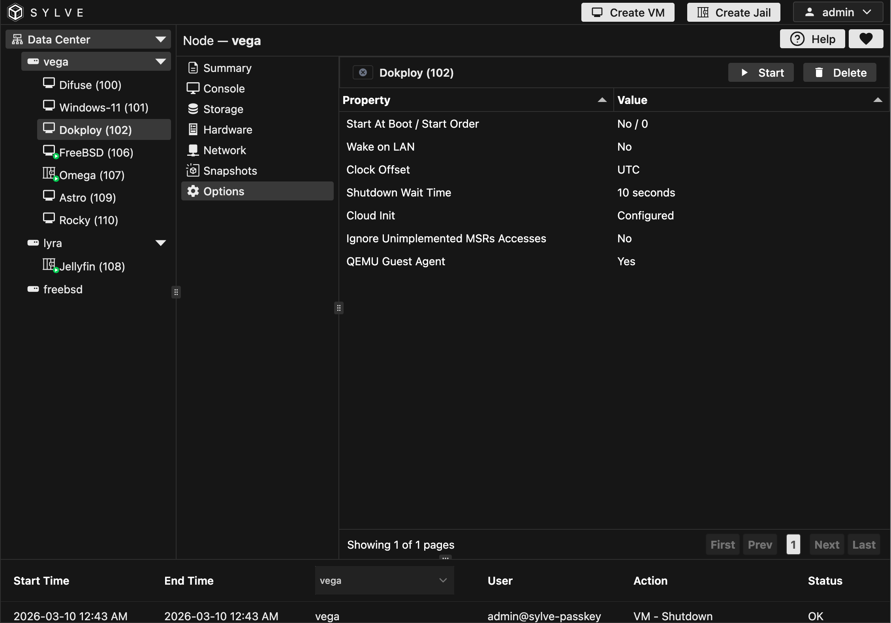

In the Options section, you can manage your VM's generic options. Most of these options are self explanatory:

:::note
WakeOnLan listens to all network interfaces, so if you have a VM with multiple network interfaces, you can wake it up by sending a magic packet to any of its MAC addresses.
:::

If you change cloud-init configuration, the second boot might not trigger re-initialization of cloud-init, so for your specific distro find out how to trigger cloud-init re-initialization.
