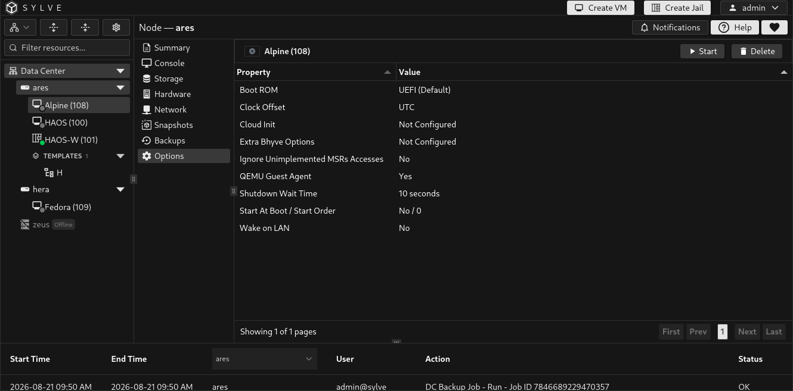
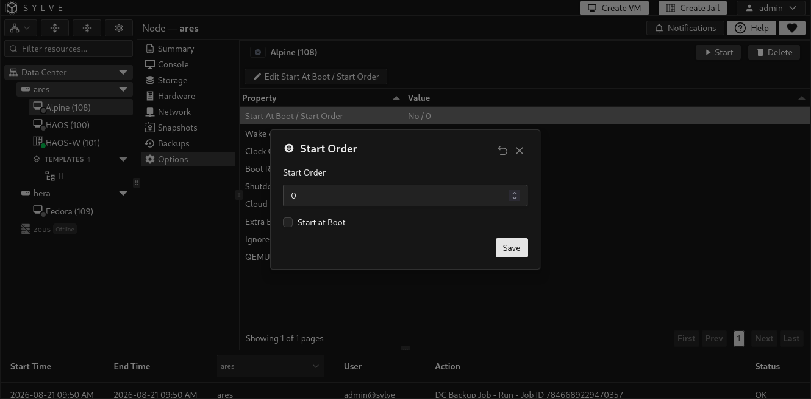
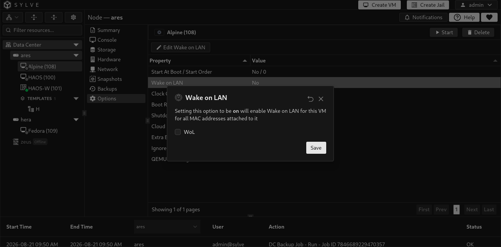
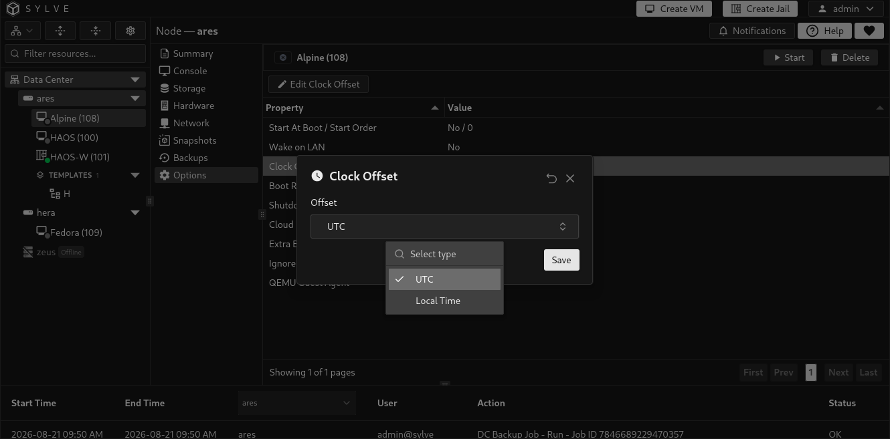
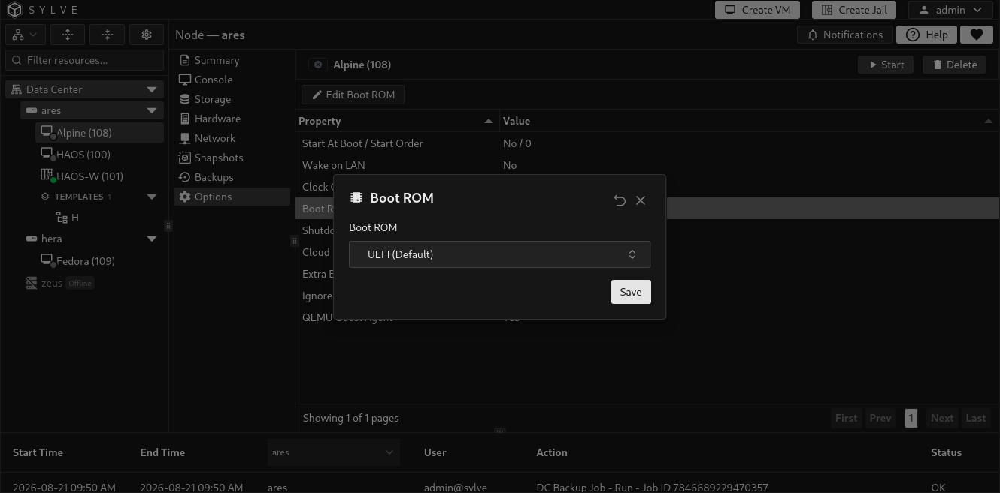
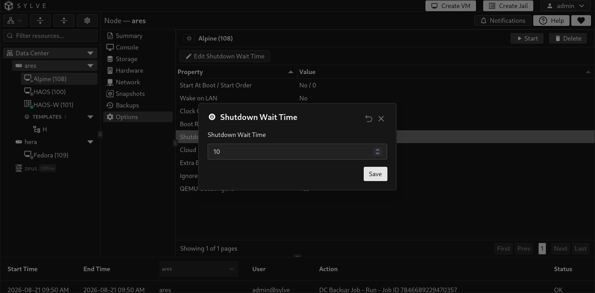
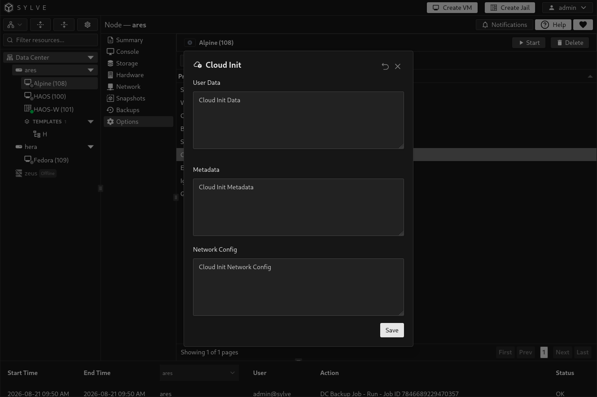
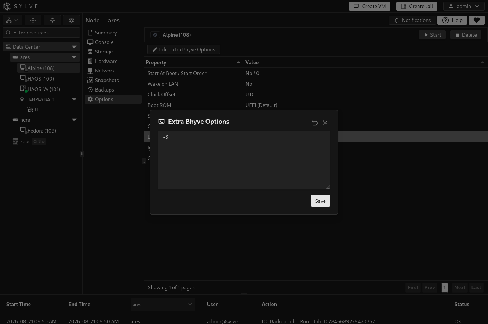
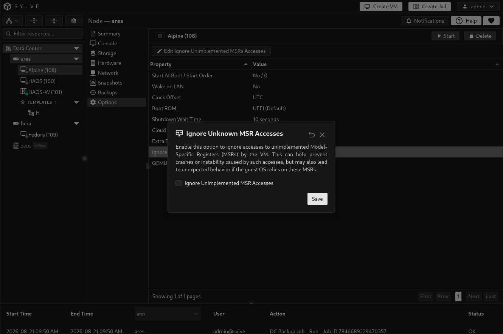
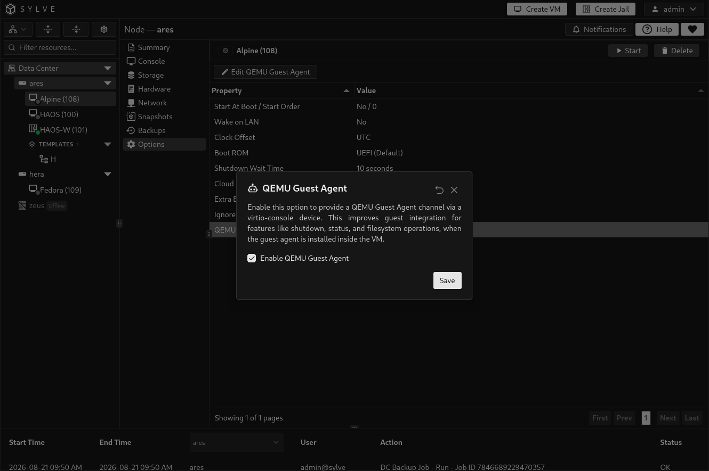

The **Options** tab contains VM-wide behavior that does not belong to an individual disk, network interface, or hardware device. Select an option in the table, then choose **Edit** to change it.

:::note
**Start At Boot**, **Start Order**, **Wake on LAN**, and **Shutdown Wait Time** can be changed while the VM is running. Every other option requires the VM to be shut down before Sylve will apply it.
:::

## Start at boot and start order

Enable **Start at Boot** to start the VM when the node starts. **Start Order** is a non-negative whole number that controls its relative position among the node's autostart VMs. Use lower values for infrastructure that needs to be ready first, such as a router or DNS server.

The order is meaningful only for VMs with Start at Boot enabled. It is not a boot delay and does not guarantee that services inside an earlier VM are fully ready before the next one starts.

## Wake on LAN

Enable **Wake on LAN** to allow a magic packet to start this VM. Sylve accepts magic packets for every MAC address currently attached to the VM, so a VM with several interfaces can be woken through any one of them.

## Clock offset

Choose **UTC** for most modern guests. Choose **Local Time** only when the guest operating system expects its hardware clock to be local time. Mixing the host, guest, and operating-system time assumptions can cause clock shifts after reboots or daylight-saving changes.

## Boot ROM

The available firmware depends on the node architecture:

| Node architecture | Available boot ROMs |
| --- | --- |
| `amd64` | **UEFI (Default)** or **None** |
| `arm64` | **U-Boot (Default)** or **None** |

Choose **None** only when the guest has a specific boot arrangement that does not need Sylve-managed firmware. Changing firmware can make an existing guest unbootable until its bootloader and disk layout match the new choice.

## Shutdown wait time

**Shutdown Wait Time** is the time, from 1 to 3,600 seconds, Sylve allows a graceful guest shutdown to complete before it forces the VM off. Set a longer value for operating systems or applications that need additional time to stop cleanly.

## Cloud-Init

Use **Cloud Init** to edit the VM's embedded Cloud-Init **User Data**, **Metadata**, and optional **Network Config**. User Data and Metadata must either both be empty or both be supplied, and Sylve validates all provided content as YAML.

Cloud-Init only works when the VM uses a Cloud-Init-capable guest image. Download an image of that type through [Downloader](/guides/node/utilities/downloader/) or use a [Cloud-Init template](/guides/node/utilities/cloud-init-templates/) when creating the VM.

:::caution
Most Cloud-Init distributions run their first-boot configuration once. Editing these fields does not necessarily reapply them to an existing guest. Follow the guest distribution's documented Cloud-Init clean or reinitialization process when you need it to consume changed data.
:::

## Extra bhyve options

**Extra Bhyve Options** is an advanced escape hatch for passing additional bhyve arguments to this VM. Enter one option per line. Sylve removes blank lines, preserves the remaining option order, and limits the configuration to 128 options, 4,096 bytes per option, and 64 KiB in total.

:::caution
Use extra bhyve options only when you understand the bhyve argument and have a specific requirement. An invalid or conflicting option can prevent the VM from starting. Prefer a supported setting elsewhere in Sylve whenever one exists.
:::

## Ignore unimplemented MSR accesses

**Ignore Unimplemented MSR Accesses** makes bhyve ignore guest accesses to Model-Specific Registers it does not implement. Use it only as a compatibility workaround for a known guest problem. It can avoid failures caused by unsupported MSR accesses, but may hide behavior the guest expects and lead to other instability.

## QEMU Guest Agent

Enable **QEMU Guest Agent** to add the VirtIO guest-agent channel. Install and run the compatible guest agent inside the VM as well. When both sides are ready, Sylve can use it for improved guest integration, including guest-aware shutdown, status, and filesystem operations.

Enabling the option alone does not install or start the agent in the guest.

