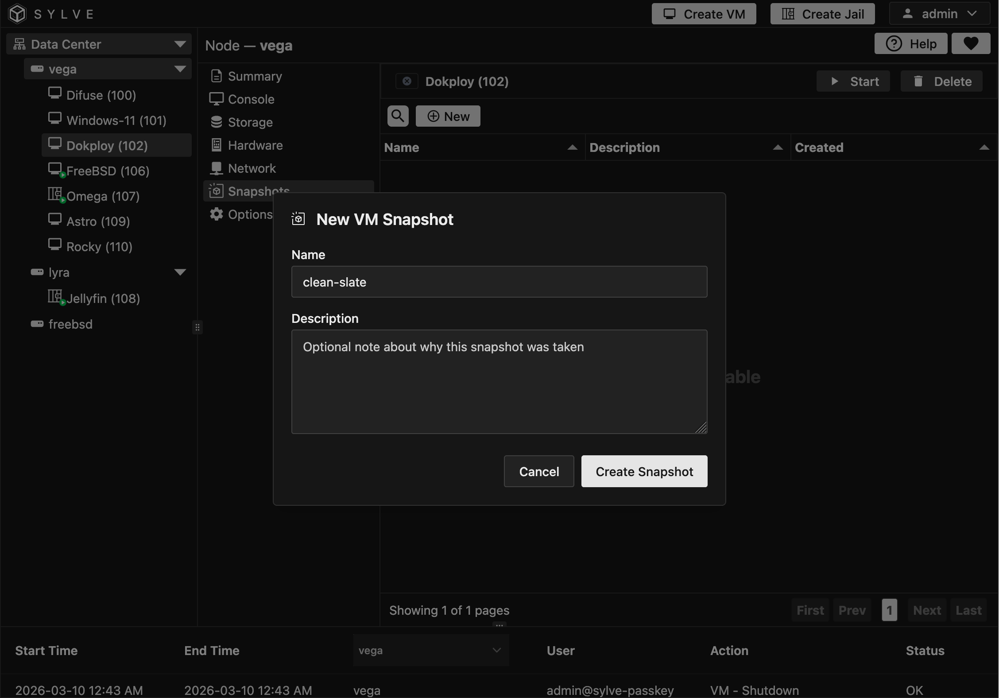

:::note
Bhyve doesn't support RAM/CPU state snapshots **yet**, so these snapshots only contain the disk state of the VM. This means that when you restore a snapshot, the VM will be in a powered off state, and any unsaved data in RAM will be lost.
:::

In the Snapshots section, you can manage your VM's snapshots. You can create, delete, and restore snapshots here.

## Creating a Snapshot

To create a snapshot, click the "New" button. You will be prompted to enter a name for the snapshot. Once you have entered a name, you can also specify an optional description. Click "Create Snapshot" to create the snapshot.

Now these snapshots are special, they contain only the disk state of the VM. This means that when you restore a snapshot, the VM will be in a powered off state, and any unsaved data in RAM will be lost. But these snapshots also contain the complete configuration of a VM down to it's last network object, so if you are going to make some changes to your VM and want to be able to easily revert back, creating a snapshot is a great way to do that.

## Deleting a Snapshot

To delete a snapshot, after clicking on a row in the snapshot table, click the "Delete" button. You will be prompted to confirm the deletion. Proceed with the deletion if you are sure.

:::caution
These snapshots will NOT be included for backup or replication, take a backup of the VM itself if you want to ensure that the data you need is protected.
:::
