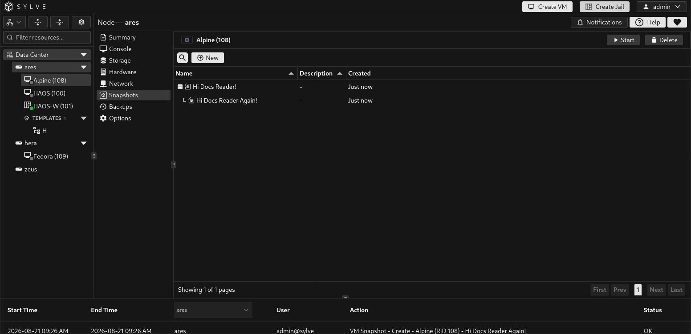
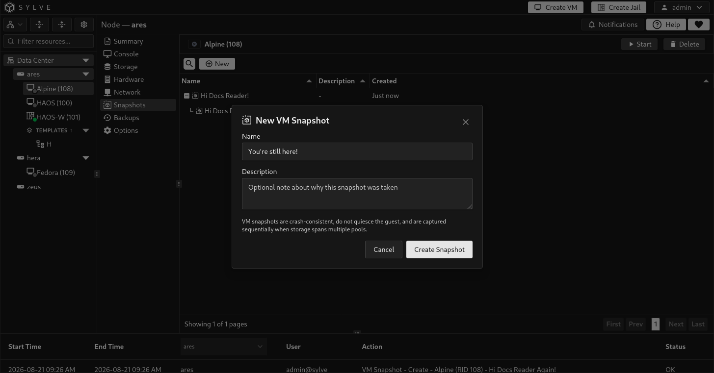
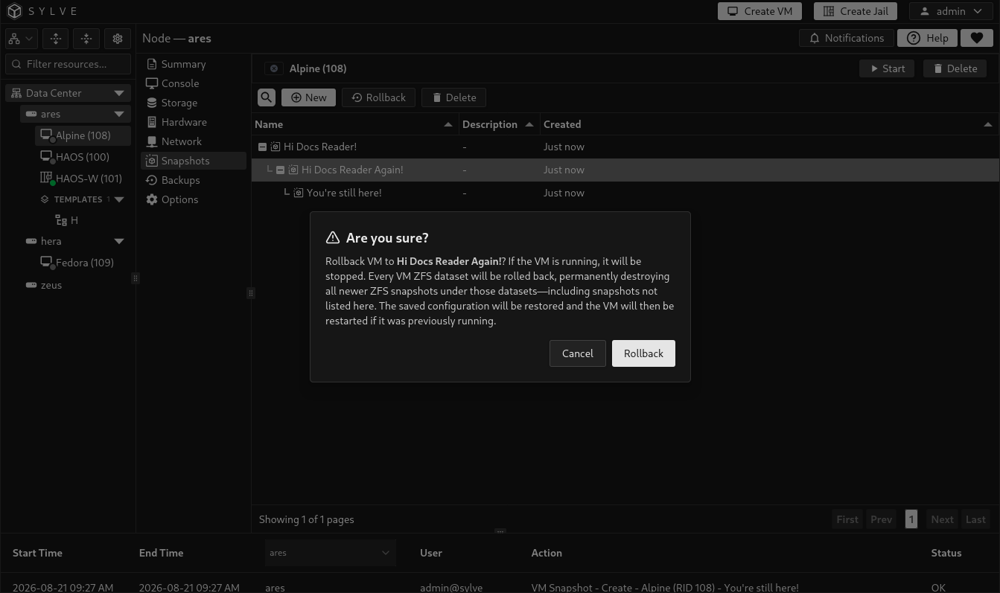
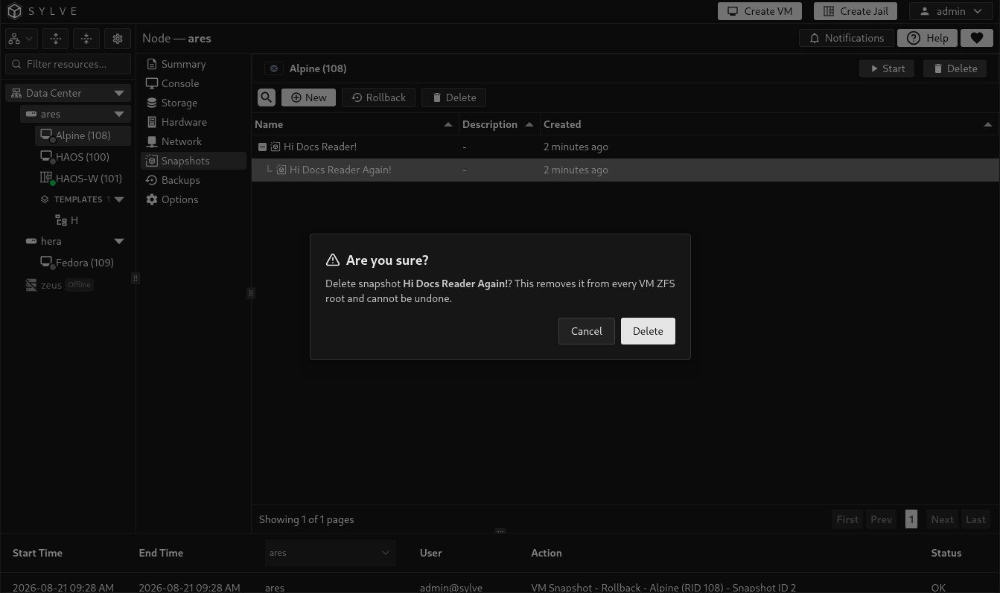

VM snapshots are local ZFS recovery points. They capture the VM's managed ZFS storage and the Sylve VM configuration needed to reconstruct it, including its storage, network interfaces, CPU configuration, VNC settings, serial setting, TPM setting, and other supported hardware settings.

:::caution
Snapshots are **crash-consistent**, not memory snapshots. Sylve does not quiesce the guest or capture RAM and CPU execution state. Treat a snapshot of a running VM like an unexpected power loss: applications may need their own recovery when it starts again.
:::

## Create a snapshot

Select **New**, enter a meaningful **Name**, and optionally add a **Description**. Names can be up to 128 characters and descriptions up to 4,096 characters.

Sylve creates a recursive ZFS snapshot under every managed ZFS root used by the VM. When a VM has storage across multiple pools, Sylve captures each root in sequence and records them as one VM recovery point. A snapshot is not a single atomic write across pools, so keep the guest quiet or shut it down first when application-level consistency matters.

Snapshots require managed ZFS-backed VM storage. A VM that uses only storage without a ZFS root cannot use this feature.

## Read the snapshot tree

Snapshots are displayed oldest first as a tree. Each new snapshot is recorded as a child of the most recently created snapshot, so the layout shows the recovery-point history clearly.

| Column | Meaning |
| --- | --- |
| **Name** | The name you supplied when creating the recovery point. |
| **Description** | The optional operational note attached to it. |
| **Created** | How long ago the snapshot was created. Hover to see its full timestamp. |
| **ZFS Snapshot Name** | The generated ZFS snapshot identifier. This column is hidden by default and can be copied when shown. |

## Roll back a VM

Select one snapshot, then choose **Rollback**. Sylve performs preflight checks before changing storage, stops the VM if it is running, rolls back every recorded ZFS root, restores the saved VM configuration, and redefines the VM. If it was running before rollback, Sylve attempts to start it again afterward.

:::caution
Rollback permanently destroys every newer ZFS snapshot under the VM's managed datasets, including snapshots that are not listed in this table. Ensure that you do not need any newer recovery point before confirming the action.
:::

Sylve may show warnings if it has to reconcile historical hardware, network, or storage references with the current node. Review any warnings before relying on the restarted VM.

## Delete a snapshot

Select a snapshot and choose **Delete** to remove that recovery point from every recorded VM ZFS root. This cannot be undone. Deleting a snapshot removes only that entry from the displayed history; any child entries are retained and reparented in the history tree.

## Snapshots, backups, and replication

Use VM snapshots for quick, local rollback before an upgrade, configuration change, or risky maintenance task. They are not a substitute for a separate recovery copy.

- Use [Backups](/guides/data-center/backups/jobs/) to retain recoverable VM data on a backup target.
- Use [Replication](/guides/data-center/replication/) to maintain a coordinated replica on another cluster node.

Snapshots are managed independently from those workflows. Create a backup or configure replication when the recovery point must survive a pool, node, or site failure.
