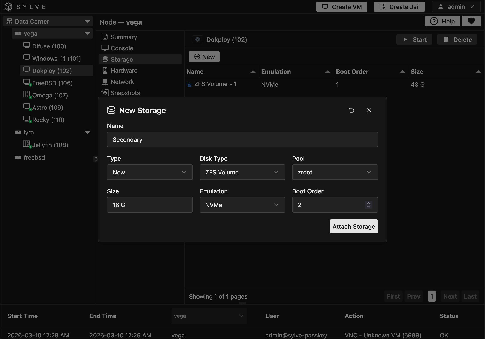
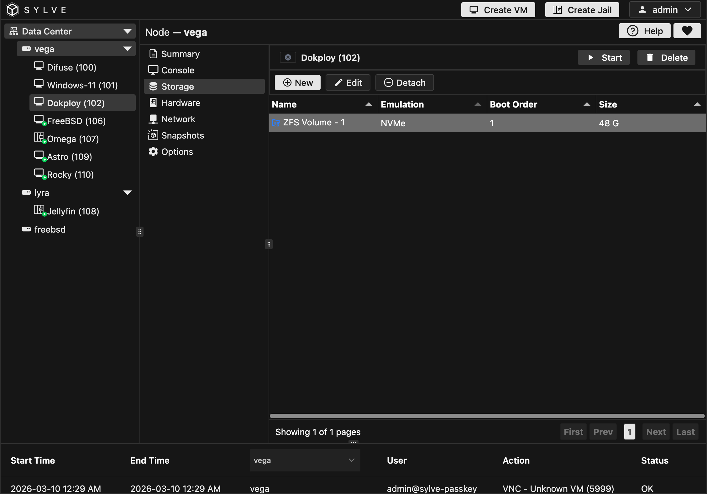

In the Storage section, you can manage your VM's storage volumes. This includes creating new volumes, attaching or detaching them to/from your VMs, and viewing their details.

Basically there are 2 types of attachments that you can do to your VM, the first one is creating a new storage media and then attaching it, the other one is where you import an existing disk.

:::note
We don't support cloning ZFS volumes yet, so if you import a ZFS volume, it will be **RENAMED** **NOT** copied, so make sure to create a copy of the ZFS volume you want to import before importing it if need be.
:::

## Creating New Storage

Most of the fields are self explanatory, but just a quick not about pool selection: try not to mix different types of storage media in the same pool, for example don't mix SSDs and HDDs in the same pool, this can lead to performance issues.

## Editing / Detaching Storage

If you click on a row in the table the context menu lets you both Edit a storage device and also detach it from the VM. Detach is exactly what it sounds like, it DOES NOT delete the storage media, it just detaches it from the VM, you have to manually delete it from the ZFS section, this is just done so that you don't accidentally delete a storage media when you just want to detach it from the VM.

