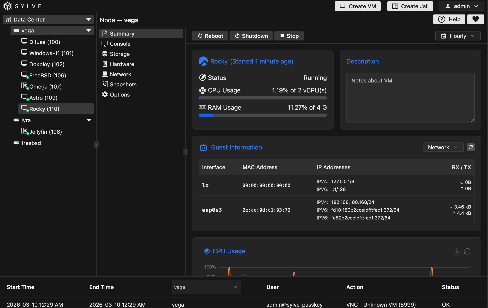

The charts are just like the ones in the main dashboard, you can adjust them as you see fit, you can also perform lifecycle actions (start, reboot, stop and delete) here and through out the context of the VM.

