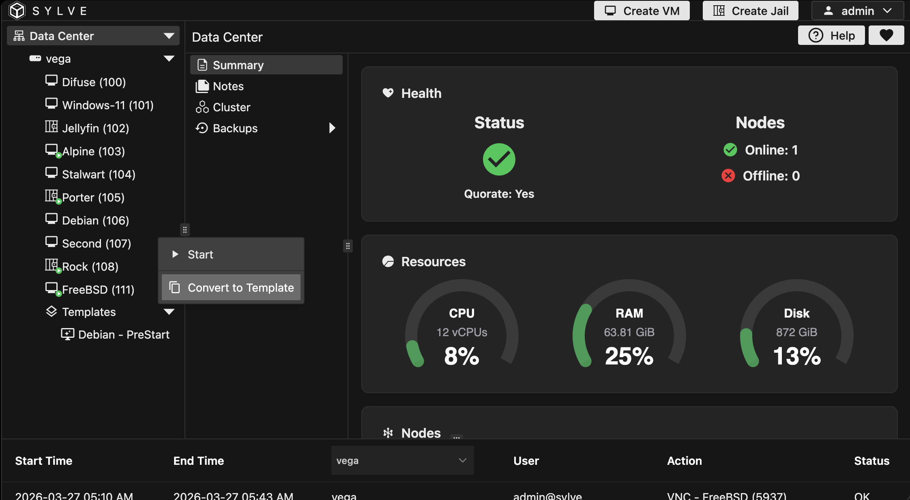
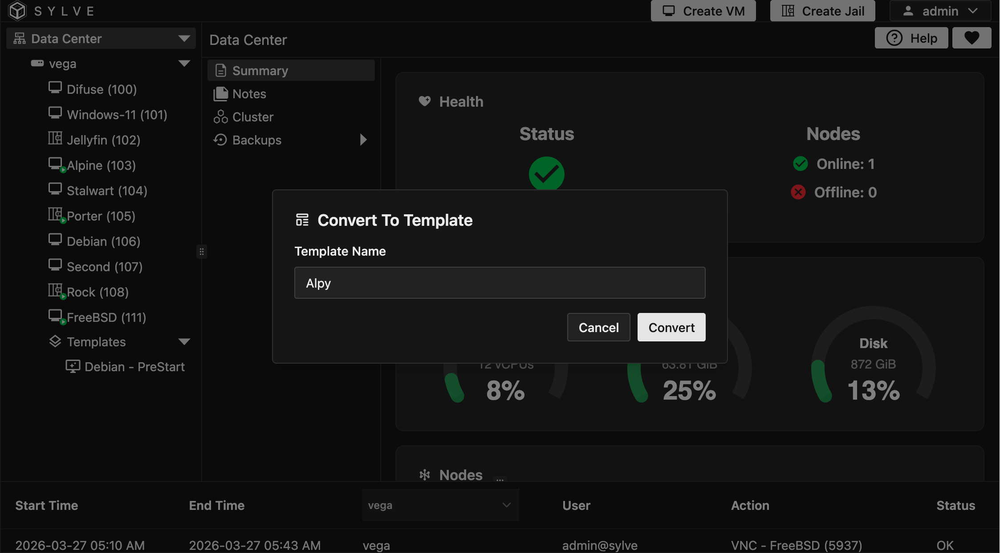
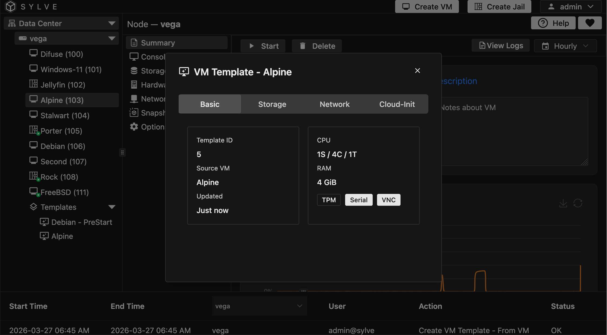
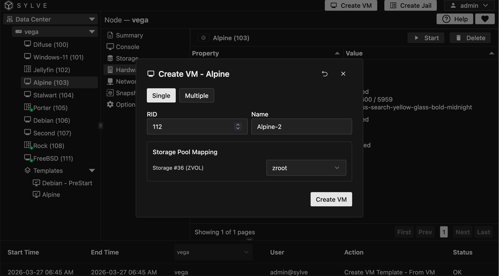

Templates in Sylve are incredibly powerful. You can use them to create one or more VMs with pre-configured settings, such as the storage, CPU, memory, and more. 

## Creating a Template

:::note
You must turn off a VM before you can convert it to a template, this is enforced to ensure disk consistency.
:::

To create a template, you need a base VM that you can use as a blueprint. Once you have that you can right click on the VM you want to template and select "Convert To Template". This will create a new template based on the VM's current configuration. You can remove the VM after creating the template if you no longer need it, all templates are **full copies** meaning they are not linked to the original VM in any way.

Once you click on the "Convert To Template" button, you'll be prompted to enter a name for your template. After you enter the name and confirm, the template will be created and you will see that in the left sidebar under the "Templates" section.

:::caution
A few things are not copied over from the Base VM when creating a template, these include:

- **TPM State**
- **NVRAM State**
- **Network Objects**: MAC Addresses are not copied over, this is to prevent conflicts when creating multiple VMs from the same template, Sylve will generate new MAC addresses for each network interface when creating a VM from a template.
:::

## Using a Template

### Summary

You can right click on a template and view it's summary, this will show you the template's configurations.

### Create VM from Template

Creating a VM is trivial, you can pick `Single` or `Multiple`, in our case we opted for a single VM with the name `Alpine-2`. You also get to choose where the VMs storage will go.

Once you hit "Create VM", it will start the creating process and in a few seconds/minutes (depending on the template's size) your VM will be ready to use!