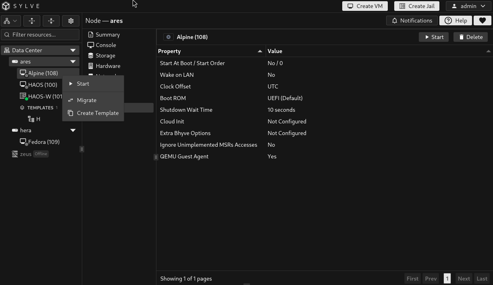
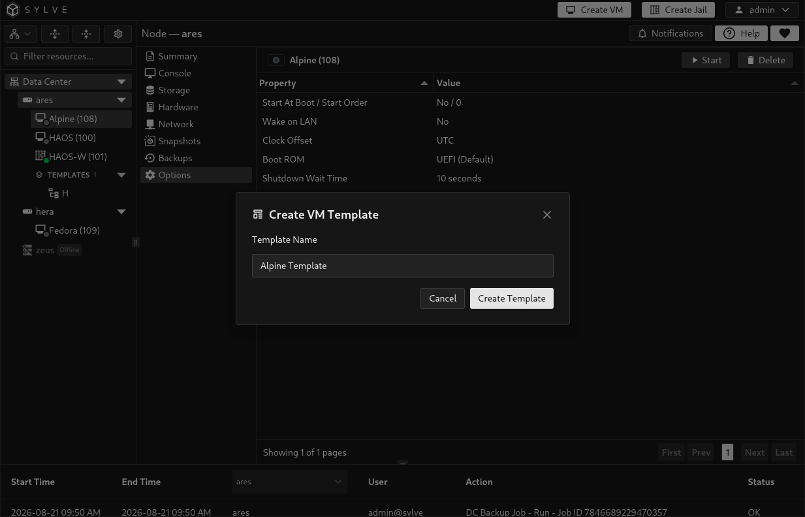
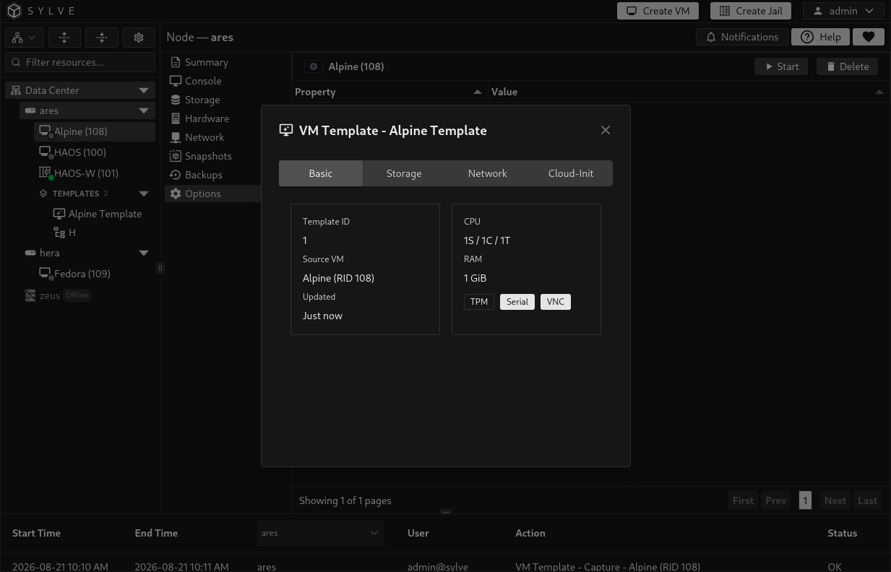
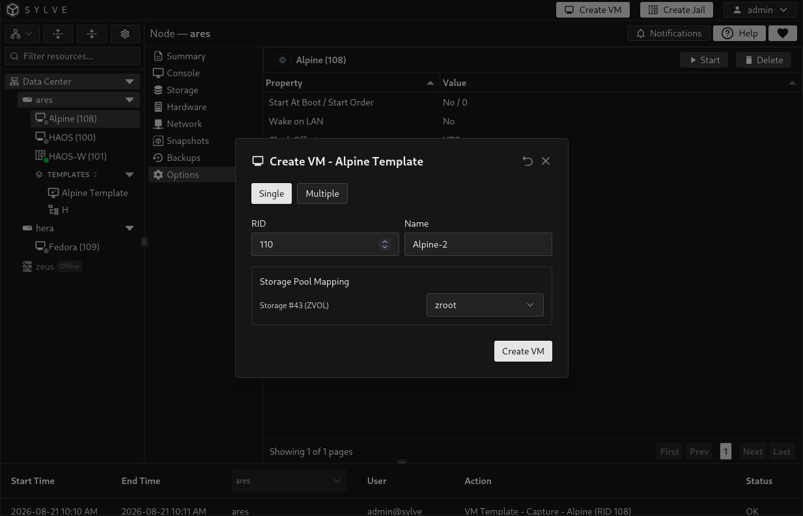
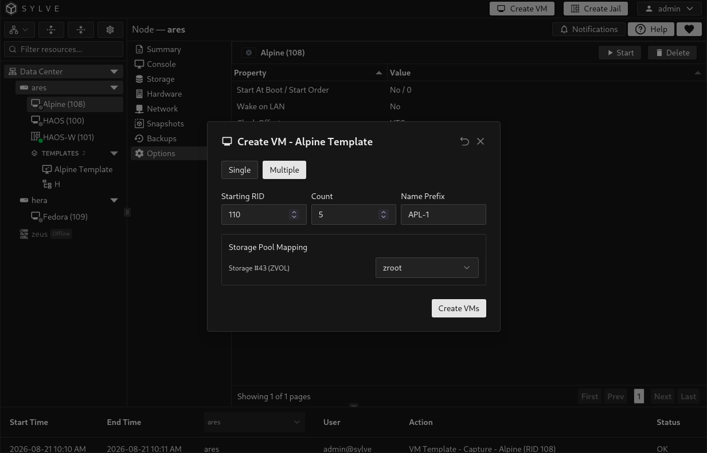
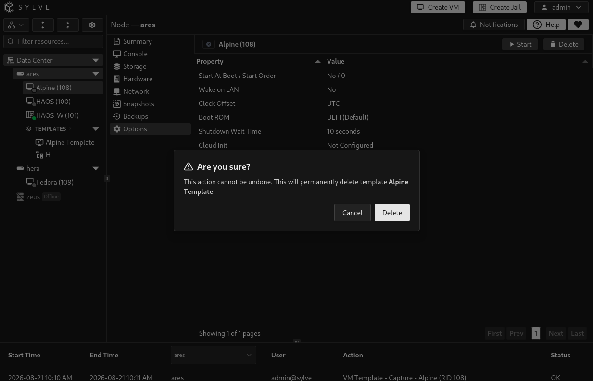

VM templates let you standardize an operating-system image and its Sylve configuration, then create new VMs from that known starting point. A template stores its own ZFS-backed copy of the source VM's cloneable storage. The source VM stays intact, and VMs created later have their own independent storage datasets.

## Prepare the source VM

Configure and test the VM as you want future VMs to begin. Install the operating system, apply updates, configure the boot disk and network interfaces, and optionally add Cloud-Init data.

:::caution
The source VM must be shut down before conversion. Sylve enforces this so its disk contents are captured from a stopped, consistent VM state.
:::

Templates require at least one managed **Raw Disk** or **ZFS Volume**. Filesystem shares and other non-cloneable storage are not captured. Sylve also checks that the source pools have enough free space to store the template copy.

## Convert a VM to a template

Open the source VM's actions and choose **Convert to Template**. Enter a unique template name, then confirm the conversion. The new template appears in the sidebar's Templates section when its task completes.

During conversion, Sylve copies each supported storage dataset to the template hierarchy on its original pool. The template is separate from the source VM, so you may keep, repurpose, or delete the original VM after checking that the template is usable.

### What the template retains

The template preserves the VM's intended configuration, including CPU topology, RAM, storage layout and boot order, network switch connections and emulation, firmware, console configuration, Cloud-Init data, selected options, and supported device settings.

### What each new VM receives instead

Some values are intentionally regenerated or reset so copies do not conflict with the source or one another.

| Setting | Behavior for a VM created from the template |
| --- | --- |
| **RID and name** | New values chosen in the creation dialog. |
| **Storage** | New independent Raw Disk or ZFS Volume datasets, created from the template copy. |
| **MAC addresses** | New unique MAC objects for every template network interface. |
| **VNC port and password** | A new available port and a new generated password. |
| **Start at Boot, Start Order, Wake on LAN** | Reset to disabled, order `0`, and disabled respectively. |
| **CPU pinning and PCI passthrough assignments** | Not carried over. Assign them deliberately to each new VM. |
| **TPM and firmware runtime state** | Fresh per-VM state. Do not expect enrolled TPM secrets or mutable firmware variables from the source VM to be reused. |

## Inspect a template

Open a template's **View** action to check it before deploying from it. The dialog groups the retained configuration into **Basic**, **Storage**, **Network**, and **Cloud-Init** tabs.

Use this view to confirm the required disk layout and pool origin, that every required switch still exists, and that no credentials or machine-specific identity were accidentally left in Cloud-Init data.

## Create VMs from a template

Choose **Create VM** on a template. The dialog loads the template and the node's available ZFS pools, then offers **Single** and **Multiple** creation modes.

### Single VM

Choose a unique **RID**, optionally set a name, and select a destination pool for every template storage item. Sylve suggests the original pool when it is available, but each disk can be mapped to a different available pool.

### Multiple VMs

Choose a **Starting RID**, a **Count**, and an optional **Name Prefix**. Sylve creates a consecutive RID range. A batch can contain up to 200 VMs, and every RID and generated name must be available before creation begins.

| Field | Description |
| --- | --- |
| **RID / Starting RID** | The one RID, or first RID in the consecutive range. RIDs must be from `1` to `9999`. |
| **Name / Name Prefix** | An optional name for one VM, or prefix used to name every VM in a batch. |
| **Count** | Number of VMs in a multiple-creation batch, from 1 to 200. |
| **Storage Pool Mapping** | Destination ZFS pool for each Raw Disk or ZFS Volume in the template. |

### Cloud-Init identity rewriting

If the template contains Cloud-Init data, you can enable **Rewrite cloud-init hostname + instance-id**. Sylve updates the metadata identity for each created VM so Cloud-Init treats it as a new instance. An optional **Identity Prefix** lets you choose the generated hostname prefix.

Enable this when using a Cloud-Init image to create more than one instance. It avoids reusing the template's machine identity and helps first-boot configuration run as expected.

## Preflight checks and recovery

Before creating anything, Sylve checks the template storage datasets, selected pools and free capacity, RID and VM-name availability, and template network switches. If a check fails, no new VM is created. If a later creation step in a batch fails, Sylve cleans up VMs already created by that request.

:::note
Templates are node-local. Create the template and its VMs on the same node, or use the relevant migration and backup workflows to move workloads between nodes.
:::

## Delete a template

Deleting a template removes its template storage datasets and its template definition. It does not delete VMs that were previously created from it because their storage is independent. Keep the template while you need to create more identical VMs or retain it as a reusable golden image.

